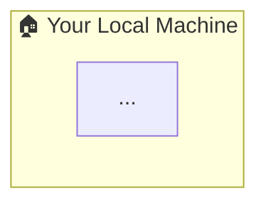

# CLAUDE.md

This file provides guidance to Claude Code (claude.ai/code) when working with code in this repository.

## What This Repo Is

A personal curated vault of GitHub repositories and websites, maintained by [@amir-sharfu](https://github.com/amir-sharfu). No build system, no dependencies — pure Markdown.

## Structure

```
repo-vault/
├── README.md              ← main index with quick stats table
├── ai-ml.md               ← AI & ML repos
├── automation.md          ← automation repos
├── devtools.md            ← developer tool repos
├── learning.md            ← learning resource repos
├── security.md            ← security repos
├── websites.md            ← curated websites (organized by category)
├── notes/                 ← deep-dive notes for websites
│   └── <site>.md
└── repo-insider/          ← deep-dive notes for GitHub repos
    └── <repo-name>/
        └── README.md
```

## Two-Tier Documentation Pattern

**Tier 1 — Category tables** (`ai-ml.md`, `security.md`, etc.)
Quick-reference rows. Repo table format:
```
| Repo | Stars | Description | Notes | Added |
```
Website table format (`websites.md`):
```
| Site | URL | Description | Tags | Added |
```

**Tier 2 — Deep-dive notes**
- Websites → `notes/<site>.md`
- GitHub repos → `repo-insider/<repo-name>/README.md`

## Adding a New Repo

1. Add a row to the relevant category file (`ai-ml.md`, `security.md`, etc.) with a link to `./repo-insider/<repo-name>/README.md` in the Notes column
2. Create `repo-insider/<repo-name>/README.md` following the template below
3. Update the Quick Stats count in `README.md`

### `repo-insider` README template

```markdown
# <Name> — <Subtitle>

> **Repo:** [org/name](https://github.com/org/name)
> **Stars:** Xk+ | **License:** X | **Built by:** X
> **Runs:** <where it runs>

---

## What is it?
## The Problem It Solves
## How It Works         ← include Mermaid diagram here
## Core Features
## Real-World Use Cases
## When to Use It
```

The **How It Works** section must include a Mermaid diagram wrapped in the local machine house container:



## Adding a New Website

1. Add a row to the relevant section in `websites.md`
2. Create `notes/<site>.md` and link to it inline in the Description column: `description text [notes](./notes/<site>.md)`

### `notes/` file template

```markdown
# <Name> — <Subtitle>

> Site: [name](URL)
> Category: <category>
> Added: YYYY-MM-DD

## What is <Name>? (1 Sentence)
## The Problem It Solves
## Core Features / How It Works
## Real-World Examples
## Why It Matters
## Key Facts / By the Numbers
## When to Use It
```

## Dates

Always use `YYYY-MM-DD` format for the Added column.
