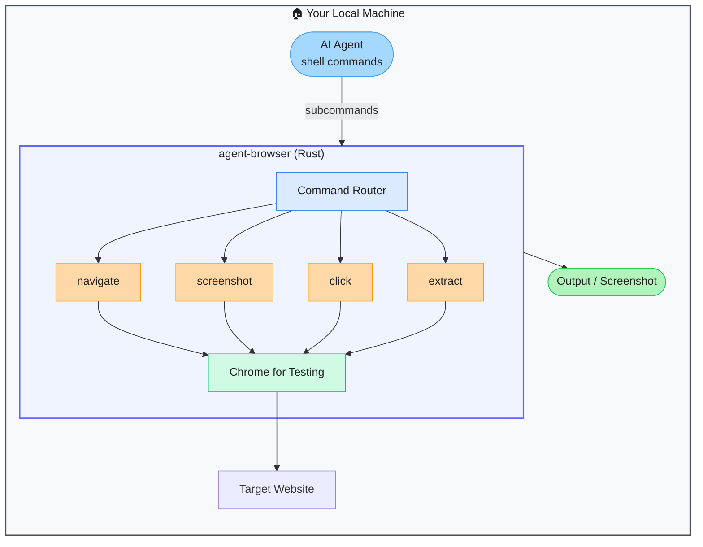

# agent-browser — Native Rust CLI Browser for AI Agents

> **Repo:** [vercel-labs/agent-browser](https://github.com/vercel-labs/agent-browser)
> **Stars:**  | **License:** Apache 2.0 | **Built by:** Vercel Labs
> **Runs:** Locally — macOS, Linux, Windows; single native binary

---

## What is it?

agent-browser is a native Rust CLI that wraps Chrome for Testing as a headless browser designed specifically for AI agents. It is a single binary with zero Node.js overhead — agents call it directly from the shell with navigate, screenshot, click, and extract commands.

---

## The Problem It Solves

| Node.js Browser Automation | agent-browser |
|---------------------------|--------------|
| Requires Node.js runtime and Playwright/Puppeteer setup | Single Rust binary — install and run |
| Process startup adds latency to agentic shell sessions | Native binary with minimal overhead |
| Agents need a CLI-native browser for shell command sequences | Purpose-built for terminal-first agentic workflows |

---

## How It Works

The agent calls `agent-browser navigate URL`, `agent-browser screenshot`, or `agent-browser extract` directly from the shell. Chrome for Testing is downloaded on first run. No Node.js, no driver setup.

---

## Core Features

| Feature | What It Does |
|---------|--------------|
| Native Rust binary | No Node.js runtime — fast, minimal, single file |
| CLI-first design | Shell commands for navigate, screenshot, click, extract |
| Chrome for Testing | Consistent, versioned Chrome engine bundled automatically |
| Cross-platform | macOS, Linux, Windows |
| npm, Homebrew, Cargo | Multiple install methods |
| Official Vercel Labs | Maintained alongside Vercel's AI stack |

---

## Real-World Use Cases

| Task | How |
|------|-----|
| Agent captures screenshots | `agent-browser screenshot` in a shell tool call |
| Agent extracts page content | `agent-browser extract` returns structured text |
| Web research in agent loop | Agent navigates, reads, navigates, reads |

---

## When to Use It

**Good fit:**
- AI agents that call browser actions as shell commands
- Environments where minimising Node.js dependencies is a priority
- Vercel / Next.js projects where Vercel Labs tooling integrates cleanly

**Not the right tool:**
- Complex browser automation with branching logic (use Playwright or Skyvern)
- Applications needing a full JavaScript API over browser control
