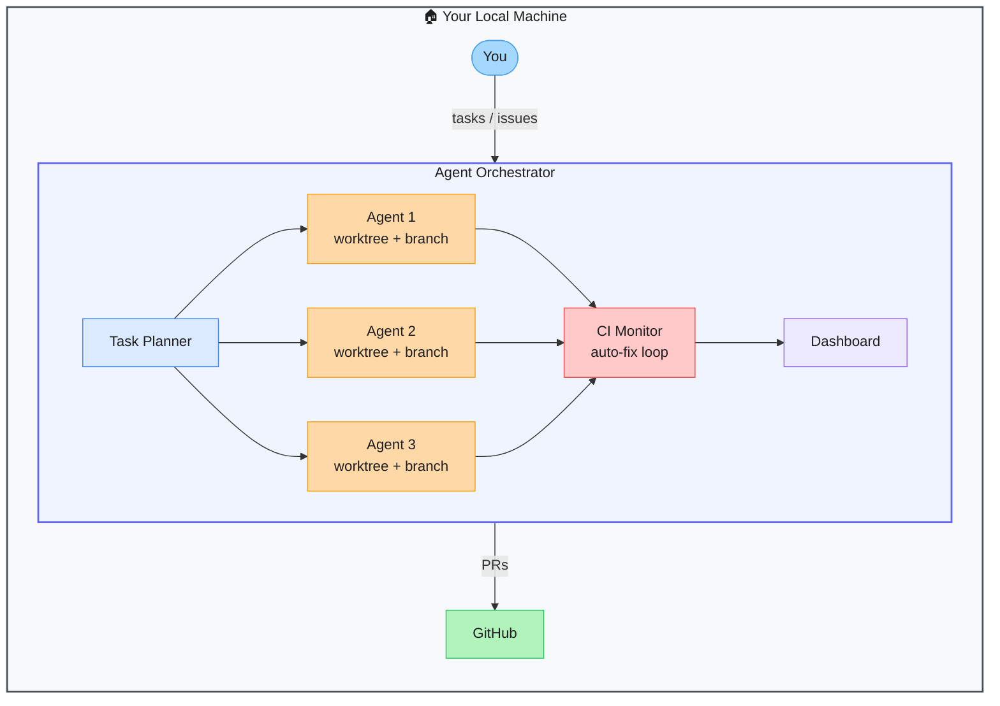

# Agent Orchestrator — Parallel AI Coding Agent Fleet Manager

> **Repo:** [ComposioHQ/agent-orchestrator](https://github.com/ComposioHQ/agent-orchestrator)
> **Stars:**  | **License:** MIT | **Built by:** ComposioHQ
> **Runs:** Locally — Node.js server + React dashboard

---

## What is it?

Agent Orchestrator runs fleets of parallel AI coding agents — each in its own isolated git worktree and branch — that autonomously fix CI failures, respond to review comments, and open PRs. A unified dashboard lets you supervise the entire fleet from one view.

---

## The Problem It Solves

| Single Coding Agent | Agent Orchestrator |
|--------------------|-------------------|
| One task at a time — slow for large backlogs | Parallelise work across many agents simultaneously |
| Agent fails CI — you manually kick off a retry | Agents auto-detect CI failures and fix them autonomously |
| No visibility into what each agent is doing | Real-time dashboard across the entire fleet |
| Agents share a codebase — risk of conflicts | Each agent gets its own git worktree |

---

## How It Works

Tasks flow into the planner, which spawns agents (Claude Code, Codex, Aider) into isolated git worktrees. Each agent works independently, monitors CI output, and retries on failure. The dashboard gives live status across all agents.

---

## Core Features

| Feature | What It Does |
|---------|--------------|
| Parallel agent fleet | Spawn as many agents as needed — each isolated in its own worktree |
| Autonomous CI fix loop | Agents detect CI failures and self-correct without human prompting |
| Multi-agent support | Works with Claude Code, OpenAI Codex, Aider — agent-agnostic |
| GitHub + Linear integration | Pull tasks from issues, push results as PRs |
| tmux + Docker runtimes | Run agents in tmux sessions or containerised environments |
| Unified dashboard | Real-time view of every agent's status, output, and branch |

---

## Real-World Use Cases

| Scenario | What You Do | What You Get |
|----------|-------------|--------------|
| Backlog sprint | Feed 10 GitHub issues | 10 agents work in parallel, open 10 PRs |
| CI flakiness | Point at failing CI runs | Agents diagnose and fix each failure autonomously |
| Code review follow-up | Pass review comments | Agents address each comment on its own branch |

---

## When to Use It

**Good fit:**
- Engineering teams with a backlog of well-defined, automatable tasks
- CI/CD pipelines where failures need fast autonomous remediation
- Any workflow where parallelising coding agents saves significant time

**Not the right tool:**
- Tasks requiring deep architectural judgment — agents work best on mechanical, well-scoped work
- Single-task sessions where one agent is sufficient
