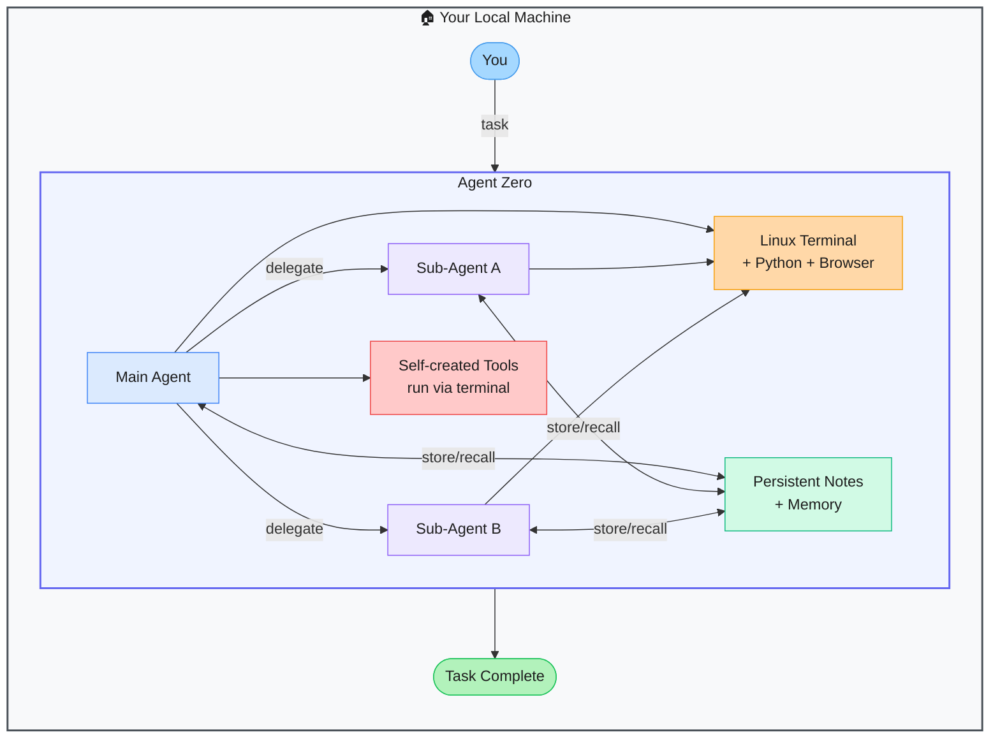

# Agent Zero — Transparent, Self-Organizing AI Agent Framework

> **Repo:** [agent0ai/agent-zero](https://github.com/agent0ai/agent-zero)
> **Stars:**  | **License:** Custom (source-available) | **Built by:** agent0ai
> **Runs:** Locally — real Linux environment as the primary action space

---

## What is it?

Agent Zero is a minimal, transparent AI agent framework where the Linux terminal is the primary tool. Instead of pre-built integrations, the agent reasons about what tools to create and use, spawns sub-agents for delegation, and learns from past tasks by persisting notes.

---

## The Problem It Solves

| Opaque Agent Frameworks | Agent Zero |
|------------------------|-----------|
| Fixed tool sets limit what the agent can do | Agent creates its own tools dynamically via the terminal |
| Black-box execution — hard to inspect or modify | Fully transparent architecture — inspect every prompt and decision |
| No learning between sessions | Persistent notes let the agent improve with each task |

---

## How It Works

The agent has access to a real Linux terminal, Python interpreter, and browser. It can write scripts, install packages, and run anything. Sub-agents can be spawned for parallel or delegated work. Notes persist across sessions so the agent learns from past runs.

---

## Core Features

| Feature | What It Does |
|---------|--------------|
| Linux terminal as primary tool | Agent writes and runs its own scripts — no fixed tool list |
| Hierarchical sub-agents | Spawn child agents to delegate tasks; parent collects results |
| Persistent memory | Notes and learned instructions survive across sessions |
| Dynamic tool creation | Agent builds the tool it needs, then uses it |
| Web UI + CLI | Control and monitor the agent either way |
| Multi-provider | OpenAI, Anthropic, Ollama, custom endpoints |

---

## Real-World Use Cases

| Task | What Agent Zero Does |
|------|---------------------|
| System administration | Writes and runs bash scripts to automate server tasks |
| Research automation | Browses web, extracts data, synthesises findings |
| Multi-step data processing | Delegates subtasks to sub-agents in parallel |
| Personal AI assistant | Learns your preferences via persistent notes |

---

## When to Use It

**Good fit:**
- Power users who want maximum agent flexibility and transparency
- Tasks requiring dynamic tool creation (no pre-built integration exists)
- Research into minimal, self-organising agent architectures

**Not the right tool:**
- Production environments where arbitrary code execution is a security risk
- Users who need a polished UI and pre-built integrations out of the box
