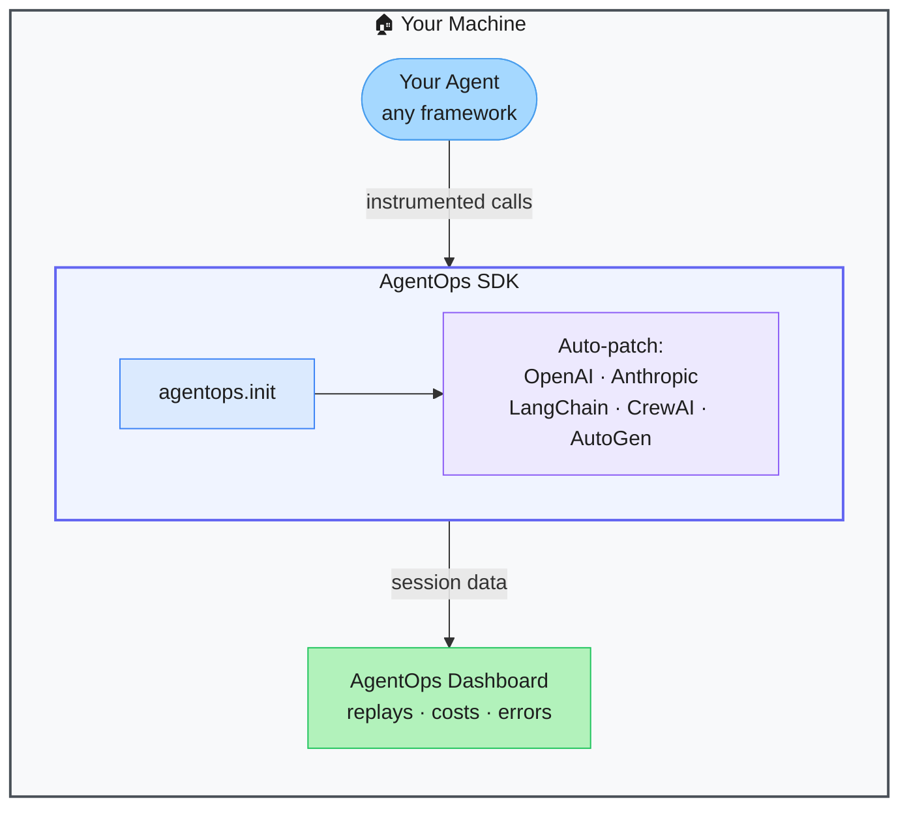

# AgentOps — One-Line Observability for AI Agents

> **Repo:** [AgentOps-AI/agentops](https://github.com/AgentOps-AI/agentops)
> **Stars:**  | **License:** MIT | **Built by:** AgentOps-AI
> **Runs:** Python SDK — data sent to AgentOps dashboard

---

## What is it?

AgentOps instruments any AI agent with one line of code. It automatically traces all LLM calls, tool invocations, and agent decisions — then surfaces session replays, cost breakdowns, and error traces in a web dashboard. Works with every major agent framework.

---

## The Problem It Solves

| Unmonitored Agents | AgentOps |
|-------------------|----------|
| No visibility into what the agent called or why | Full session replay of every LLM call and tool use |
| API costs are a black box | Per-session, per-model cost breakdown |
| Debugging failures means re-running the agent | Error traces pinpoint exactly where and why things went wrong |
| Switching frameworks breaks your monitoring | Supports CrewAI, LangChain, AutoGen, CamelAI, and more |

---

## How It Works

Add `agentops.init()` at the top of your agent code. The SDK patches OpenAI, Anthropic, and popular framework clients automatically. Every call is recorded and sent to the dashboard for replay and analysis.

---

## Core Features

| Feature | What It Does |
|---------|--------------|
| One-line init | `agentops.init()` instruments everything automatically |
| Session replay | Replay any agent run step-by-step |
| Cost tracking | LLM spend per session, agent, and model |
| Error detection | Pinpoints where and why the agent failed |
| Multi-framework | CrewAI, LangChain, AutoGen, Agno, CamelAI, and more |
| Benchmarking | Compare agent performance across runs and configurations |

---

## Real-World Use Cases

| Scenario | What You See in AgentOps |
|----------|--------------------------|
| Agent failing in production | Full trace shows which tool call errored and what it returned |
| Cost overrun on API | Per-session spend shows which agent step costs the most |
| Performance regression | Before/after comparison across agent versions |
| QA before deploying | Replay test sessions to verify agent behaviour |

---

## When to Use It

**Good fit:**
- Any production AI agent that you need to monitor and debug
- Teams managing API cost budgets across multiple agent workflows
- Anyone who finds agent debugging painfully opaque

**Not the right tool:**
- Offline / air-gapped environments (data is sent to AgentOps servers)
- Throwaway prototype scripts with no production use
