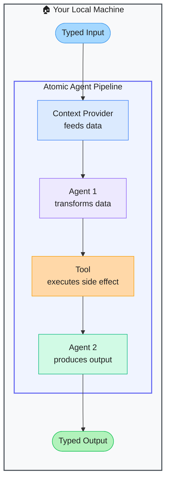

# Atomic Agents — Modular AI Agent Pipelines Built Like Software

> **Repo:** [BrainBlend-AI/atomic-agents](https://github.com/BrainBlend-AI/atomic-agents)
> **Stars:**  | **License:** MIT | **Built by:** BrainBlend-AI
> **Runs:** Locally via Python — multi-provider LLM support

---

## What is it?

Atomic Agents treats every component in an AI pipeline as a small, single-purpose, testable unit — just like functions in clean software. Built on Instructor and Pydantic, every agent has a typed input/output schema. Components snap together like LEGO blocks, making pipelines as maintainable as regular code.

---

## The Problem It Solves

| Monolithic Agent Frameworks | Atomic Agents |
|-----------------------------|--------------|
| Black-box agents are hard to test and debug | Each component is a typed, testable unit |
| Changing one part breaks the whole pipeline | Atomic components are independently replaceable |
| No contract between agent inputs and outputs | Pydantic schemas enforce types at every boundary |
| Custom tool integration requires boilerplate | Atomic Forge registry — download community tools via CLI |

---

## How It Works

Each agent is defined with a Pydantic input/output schema. The output of one agent becomes the validated input of the next. Context providers inject external data. Tools execute real-world actions. The Atomic Forge CLI lets you download pre-built community tools.

---

## Core Features

| Feature | What It Does |
|---------|--------------|
| Atomic component design | Every unit is single-purpose and independently testable |
| Pydantic + Instructor | Typed, validated I/O at every pipeline boundary |
| Context providers | First-class abstraction for feeding external data to agents |
| Atomic Forge CLI | Download pre-built tools from the community registry |
| Multi-provider support | OpenAI, Anthropic, Groq, Gemini |
| Predictable outputs | Consistent, structured results — no freeform JSON surprises |

---

## Real-World Use Cases

| Task | Why Atomic Agents |
|------|------------------|
| RAG pipeline | Context provider fetches docs; agent answers with citations |
| Data extraction | Agent parses raw text → typed Pydantic output every time |
| Multi-step research | Chain agents: search → summarise → structure → report |

---

## When to Use It

**Good fit:**
- Teams that want AI pipelines as maintainable as regular software
- Projects where reliable typed outputs are critical
- Anyone who finds larger frameworks too opaque to debug

**Not the right tool:**
- Rapid throwaway prototypes (typed schemas add setup time)
- Fully autonomous agents that must self-direct without a defined pipeline
