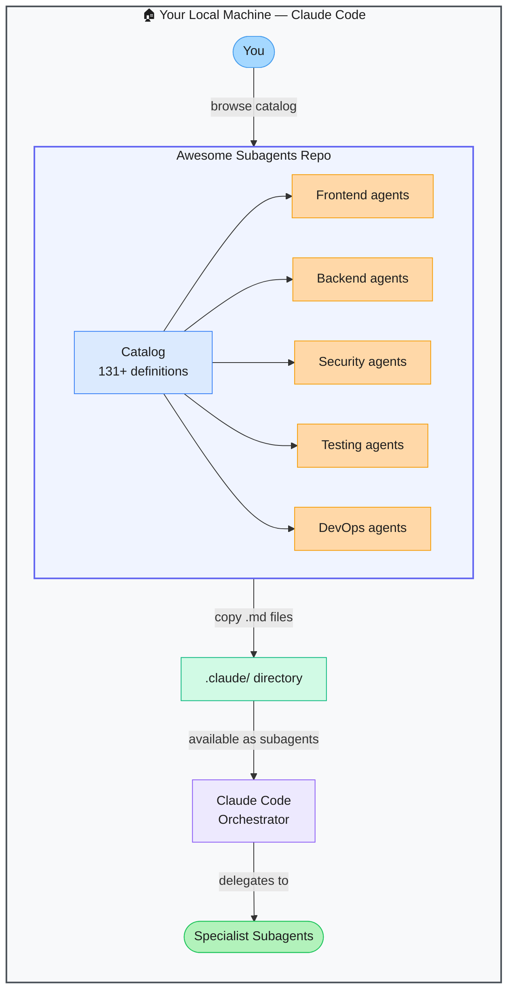

# Awesome Claude Code Subagents — 131+ Specialist Subagent Library

> **Repo:** [VoltAgent/awesome-claude-code-subagents](https://github.com/VoltAgent/awesome-claude-code-subagents)
> **Stars:**  | **License:** MIT | **Built by:** VoltAgent
> **Runs:** Inside Claude Code — copy markdown files to `.claude/` directory

---

## What is it?

A curated collection of 131+ production-ready Claude Code subagent definitions. Each subagent is a markdown file that defines a specialist role — frontend engineer, security reviewer, DevOps agent, test writer, and more. Browse the catalog, pick what you need, drop it into your `.claude/` folder, and it's immediately available.

---

## The Problem It Solves

| Writing Subagents From Scratch | Awesome Claude Code Subagents |
|-------------------------------|-------------------------------|
| Crafting effective subagent prompts takes time and iteration | 131+ battle-tested definitions ready to use |
| Hard to know what specialists you need until mid-project | Full catalog lets you browse by role before you start |
| Inconsistent quality across hand-written subagents | Community-maintained, standardised definitions |

---

## How It Works

Each subagent is a markdown file defining a Claude Code subagent with a specific specialist role. Copy the files you want to your project's `.claude/agents/` directory. Claude Code's orchestrator can then delegate tasks to those specialists automatically.

---

## Core Features

| Feature | What It Does |
|---------|--------------|
| 131+ definitions | Specialists across frontend, backend, security, testing, DevOps, and more |
| Ready to use | Copy-paste into `.claude/` — no configuration needed |
| Standardised format | All definitions follow the Claude Code subagent spec |
| Community maintained | Actively updated as Claude Code's subagent system evolves |
| Cross-referenced | Links to related resources (agent-skills, Codex subagents) |
| VoltAgent ecosystem | Maintained alongside VoltAgent's broader tooling |

---

## Real-World Use Cases

| Need | What You Pick |
|------|--------------|
| Security audit during PR | `security-reviewer` subagent |
| Write tests for new code | `test-engineer` subagent |
| Frontend component work | `react-specialist` or `vue-specialist` |
| Dockerfile and CI setup | `devops-engineer` subagent |
| Database schema design | `database-architect` subagent |

---

## When to Use It

**Good fit:**
- Claude Code users who want to extend their setup with specialist agents immediately
- Teams building Claude Code workflows who need reliable specialist definitions
- Anyone who has written subagents from scratch and wants a better starting point

**Not the right tool:**
- Non-Claude Code environments (definitions are Claude Code-specific)
- Cases requiring highly custom, domain-specific subagent behaviour with no overlap from the catalog
