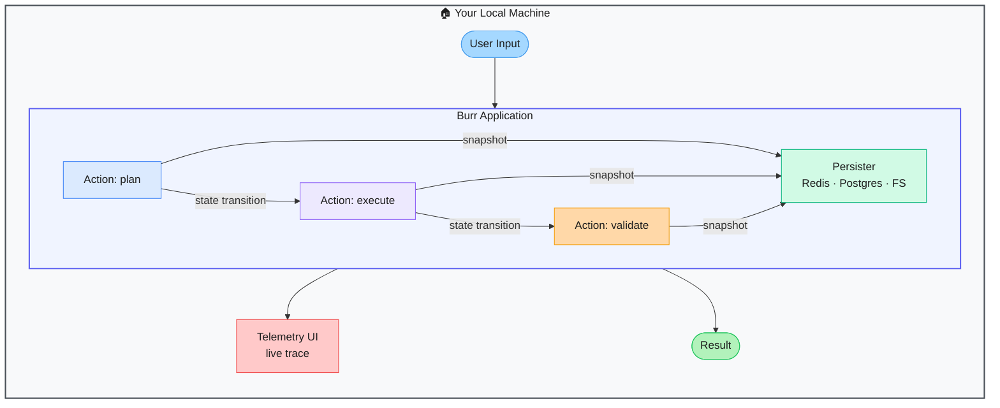

# Burr — Stateful AI Applications with Persistence and Observability

> **Repo:** [apache/burr](https://github.com/apache/burr)
> **Stars:**  | **License:** Apache 2.0 | **Built by:** DAGWorks (donated to Apache)
> **Runs:** Locally via Python — persistent backends for Redis, Postgres, or filesystem

---

## What is it?

Burr is a Python framework for building stateful AI applications — agents, chatbots, simulations — as explicit state machines. Every state transition is persisted, traceable, and resumable. A built-in UI lets you inspect the full execution trace in real time.

---

## The Problem It Solves

| LLM Apps Without Burr | With Burr |
|----------------------|-----------|
| Agent state lives in memory — lost on crash or restart | Persisted snapshots let you resume from any checkpoint |
| Debugging multi-step agent behaviour is guesswork | Real-time telemetry UI shows every state transition |
| Sequential decisions are implicit and hard to audit | Explicit state machine makes the logic readable and auditable |

---

## How It Works

You define actions as pure Python functions connected in a state graph. Burr manages transitions, persists snapshots after each step, and exposes a telemetry UI. Applications can be paused mid-execution and resumed from any checkpoint.

---

## Core Features

| Feature | What It Does |
|---------|--------------|
| State machine model | Explicit actions + transitions — no hidden control flow |
| Pluggable persisters | Redis, Postgres, filesystem — pause/resume any application |
| Built-in telemetry UI | Real-time trace inspection, state diffs, and replay |
| Pure Python actions | No decorators or magic — just functions with typed state |
| Framework integrations | Works with LangChain, LlamaIndex, Hamilton |
| Apache governance | Enterprise-ready with long-term maintenance guarantees |

---

## Real-World Use Cases

| App Type | How Burr Helps |
|----------|---------------|
| Multi-step AI agent | Persist state between steps; resume if agent crashes |
| Long-running chatbot | Full conversation history persisted and replayable |
| Human-in-the-loop workflow | Pause at a review step; human approves; agent continues |
| Simulation | Run N steps, inspect trace, replay from any point |

---

## When to Use It

**Good fit:**
- AI apps that must survive crashes and resume from where they left off
- Workflows needing full auditability of every decision step
- Teams integrating LangChain or LlamaIndex who want a proper state layer

**Not the right tool:**
- Simple one-shot LLM calls with no multi-step state
- Real-time streaming apps where persistence latency matters
