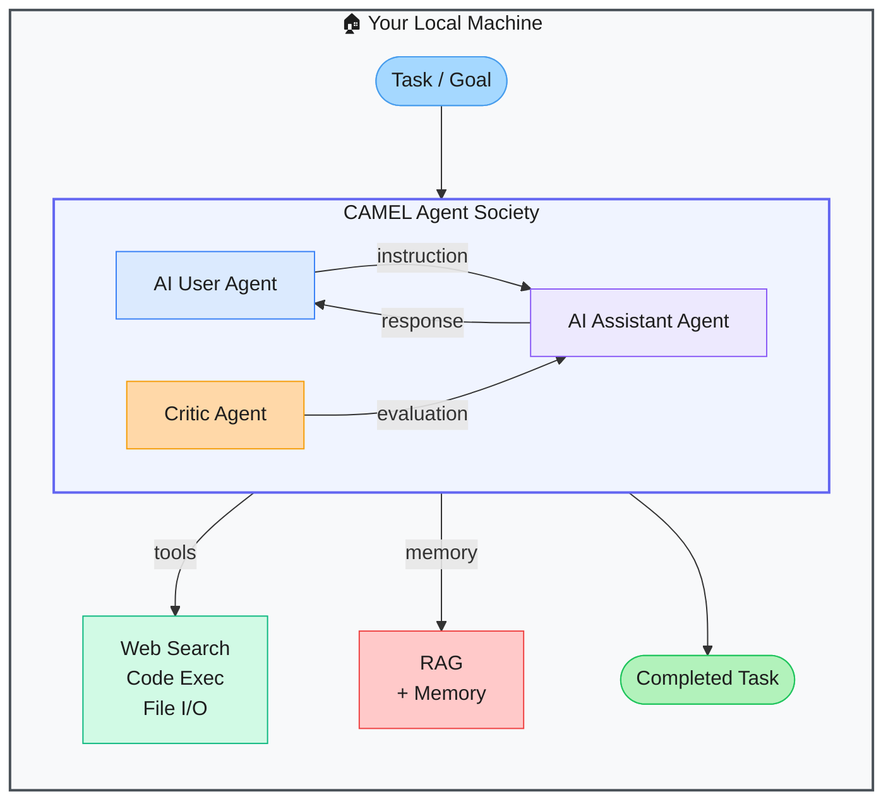

# CAMEL — Communicative Agents for Mind Exploration of Large Language Model Society

> **Repo:** [camel-ai/camel](https://github.com/camel-ai/camel)
> **Stars:**  | **License:** Apache 2.0 | **Built by:** camel-ai
> **Runs:** Locally via Python — any LLM backend

---

## What is it?

CAMEL is the first multi-agent framework, built to study how LLM-based agents can communicate, cooperate, and solve tasks together. It implements role-playing between agents (user, assistant, critic) and supports the full ecosystem needed to build and research multi-agent systems at scale.

---

## The Problem It Solves

| Without CAMEL | With CAMEL |
|--------------|------------|
| Building multi-agent cooperation requires custom scaffolding | Role-playing architecture with user/assistant/critic built in |
| No standard way to study agent communication at scale | Research-grade framework with benchmarking and evaluation harnesses |
| Agent pipelines break when switching LLM providers | Multi-model backend support — swap providers in config |

---

## How It Works

Agents are initialized with system prompts defining their roles. The framework manages the dialogue loop, memory, task decomposition, and tool use. A critic agent can evaluate outputs and trigger revision cycles.

---

## Core Features

| Feature | What It Does |
|---------|--------------|
| Role-playing architecture | User / assistant / critic agent roles with structured conversation flow |
| Multi-model support | OpenAI, Anthropic, Mistral, Gemini, and more |
| Built-in tools | Web search, code execution, file I/O |
| Memory + RAG | Long-term memory and retrieval-augmented generation |
| Benchmarking harnesses | Evaluate agent performance on standard tasks |
| Research output | Active papers on agent scaling laws |

---

## Real-World Use Cases

| Task | What You Set Up |
|------|----------------|
| Autonomous research task | User agent delegates subtasks; assistant executes; critic reviews |
| Code generation with review | Engineer agent writes, critic agent reviews for correctness |
| Multi-perspective debate | Multiple assistant agents argue different positions |

---

## When to Use It

**Good fit:**
- Researchers studying multi-agent communication and cooperation
- Developers needing a mature, flexible multi-agent framework
- Projects requiring critic/evaluation loops in the agent pipeline

**Not the right tool:**
- Simple single-agent tasks (unnecessary complexity)
- Production apps needing minimal dependencies
