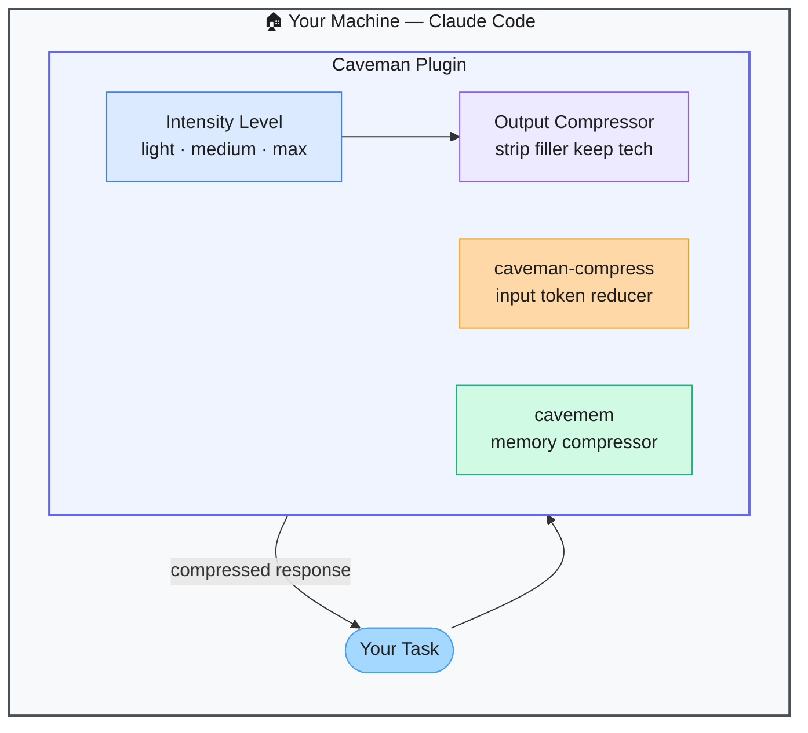

# Caveman — Token-Saving Terse Communication for Claude Code

> **Repo:** [JuliusBrussee/caveman](https://github.com/JuliusBrussee/caveman)
> **Stars:**  | **License:** MIT | **Built by:** JuliusBrussee
> **Runs:** Inside Claude Code — installed via `/plugin marketplace add`

---

## What is it?

Caveman is a Claude Code plugin that cuts output token consumption by 65–75% by making Claude respond in ultra-compressed "caveman speak" — dropping articles, pronouns, and filler words while keeping all technical content intact. Multiple intensity levels and a companion memory compressor are included.

---

## The Problem It Solves

| Standard Claude Code Responses | Caveman |
|-------------------------------|---------|
| Verbose explanations pad responses with filler | Technical content only — articles and pronouns stripped |
| Long sessions burn through context and tokens fast | 65–75% output token reduction per response |
| Input prompts also grow bloated over time | `caveman-compress` tool shrinks input tokens too |

---

## How It Works

When active, Claude responds in compressed grammar — "File not found, check path" instead of "I wasn't able to find the file you specified. Please verify the path is correct." Technical terms stay intact; only filler is stripped.

---

## Core Features

| Feature | What It Does |
|---------|--------------|
| 65–75% output token reduction | Strips filler, keeps all technical content |
| Multiple intensity levels | Light, medium, max caveman compression |
| `caveman-compress` | Compresses your input prompts too |
| `cavemem` | Memory compression companion |
| `cavekit` | Build utilities for the caveman ecosystem |
| Classical Chinese mode | Alternative compression style for maximum brevity |

---

## Real-World Use Cases

| Scenario | Benefit |
|----------|---------|
| Long agentic coding session | Session fits in context window for much longer |
| Rapid iteration loops | Faster responses, lower cost per iteration |
| API-billed Claude Code usage | Direct reduction in per-session token spend |

---

## When to Use It

**Good fit:**
- Long Claude Code sessions where token cost and context length matter
- Developers who prefer terse, technical communication from AI tools
- Anyone on a token budget who doesn't need conversational prose

**Not the right tool:**
- Situations where you need detailed explanations (e.g., learning a new concept)
- Sharing Claude Code sessions with non-technical stakeholders
