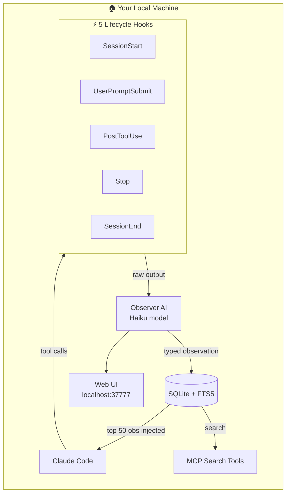

# Claude-Mem — Persistent Memory for Claude Code

> **Repo:** [thedotmack/claude-mem](https://github.com/thedotmack/claude-mem)
> **Stars:** 70.5k+ | **License:** AGPL-3.0 | **Built by:** Alex Newman (@thedotmack)
> **Runs:** Local machine (Linux, macOS, Windows) — all data stays on disk

---

## What is it?

Claude-Mem is a Claude Code plugin that gives Claude a persistent, searchable memory across sessions — so it never starts blank again.

## The Problem It Solves

Every Claude Code session starts from zero. You re-explain architecture decisions, remind it of past bugs, describe what was built last week. Claude-Mem fixes this by capturing structured observations after every tool call and injecting relevant context at session start — so Claude already knows your codebase when you open a new terminal.

## How It Works



**Four-stage lifecycle:**
1. **Session Start** — top 50 relevant observations injected into context (~40 tokens each)
2. **Live Observation** — a dedicated Haiku observer watches every tool call
3. **Processing** — worker compresses raw output into typed, structured observations
4. **Session End** — session marked complete, summary generated

**Three-tier retrieval** keeps token cost low: lightweight summaries load first (~40 tokens), full narratives (~850 tokens) pulled only on demand. Signal rate: 80% vs. 6% from naive approaches.

## Core Features

- **Automatic capture** — five lifecycle hooks record everything without manual intervention
- **Smart categorisation** — observations typed as decisions, bugfixes, features, or discoveries
- **Full-text search** — FTS5 SQLite index; query by file path, concept, or keyword
- **Context injection** — top 50 relevant observations loaded at session start
- **Web UI** — real-time memory stream at `http://localhost:37777`
- **MCP search tools** — `/mem-search`, `/timeline-report`, `/knowledge-agent` slash commands
- **Privacy controls** — wrap sensitive content in `<private>` tags to exclude from storage
- **Cross-tool** — works with Claude Code, Cursor, Gemini CLI, Windsurf, OpenClaw
- **Multi-language** — 28 language support
- **Local-only** — SQLite on disk, nothing leaves the machine

## Real-World Use Cases

- **Multi-session projects** — picks up exactly where you left off after days away
- **Decision archaeology** — query why a particular architectural choice was made 3 weeks ago
- **Bug recurrence** — surfaces the original fix when a similar error appears again
- **Multi-codebase juggling** — maintains separate context per project folder
- **Onboarding** — new team members query the memory to understand past decisions instantly

One power user captured 6,814 observations across 259 sessions covering 10 codebases in 3 weeks (39 MB SQLite file).

## When to Use It

**Use claude-mem when:**
- You work on the same codebase across multiple sessions and hate re-explaining context
- Your projects span weeks or months with complex decision history
- You switch between multiple codebases and need clean context separation

**Skip it when:**
- You're on a shared server or cloud VM (HTTP API on port 37777 has no auth — local machines only)
- The project is short-lived or one-off
- You prefer full manual control over what context Claude sees

**Setup:**
```
/plugin marketplace add thedotmack/claude-mem
/plugin install claude-mem
```
Requires: Node.js 18+, latest Claude Code, Bun (auto-installed).
