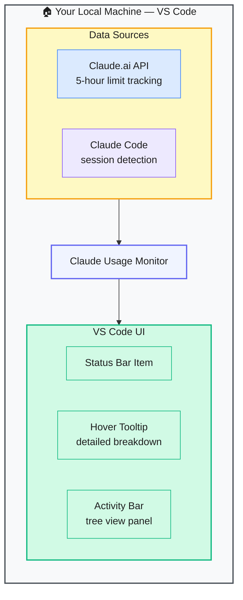

# Claude Usage Monitor — VS Code Extension for Claude Usage Tracking

> **Repo:** [Gronsten/claude-usage-monitor](https://github.com/Gronsten/claude-usage-monitor)
> **Stars:**  | **License:** MIT | **Built by:** Gronsten
> **Runs:** Inside VS Code — status bar integration

---

## What is it?

A VS Code extension that monitors both Claude.ai web session usage and Claude Code token consumption in one place — displayed directly in the VS Code status bar. Covers the 5-hour usage window for Claude.ai and token burn for local Claude Code sessions.

---

## The Problem It Solves

| Without the Extension | With Claude Usage Monitor |
|----------------------|--------------------------|
| No visibility into Claude.ai 5-hour usage limit until you hit it | Real-time usage bar in the VS Code status bar |
| Claude Code token consumption is invisible during a session | Token count visible without leaving the editor |
| Switching between browser and editor to check usage | Both metrics in one status bar item |

---

## How It Works

The extension polls the Claude.ai API for web session usage and detects local Claude Code sessions. Both appear in the status bar. Hover for a detailed tooltip; open the activity bar panel for a full breakdown.

---

## Core Features

| Feature | What It Does |
|---------|--------------|
| Dual monitoring | Claude.ai web usage + Claude Code token consumption |
| Status bar integration | Always-visible at the bottom of VS Code |
| Hover tooltip | Detailed breakdown without opening a panel |
| Tree view panel | Full usage history in the activity bar |
| Auto-refresh | Configurable polling interval |
| Multi-session detection | Tracks concurrent conversations intelligently |

---

## When to Use It

**Good fit:**
- Heavy Claude users on Pro/Max who want to track the 5-hour usage window
- Developers using Claude Code who want token visibility without leaving the editor
- Anyone who has ever been surprised by hitting a Claude usage limit mid-session

**Not the right tool:**
- Non-VS Code users (extension is VS Code only)
- API-plan users who track costs differently (this targets web + CLI usage, not raw API billing)
