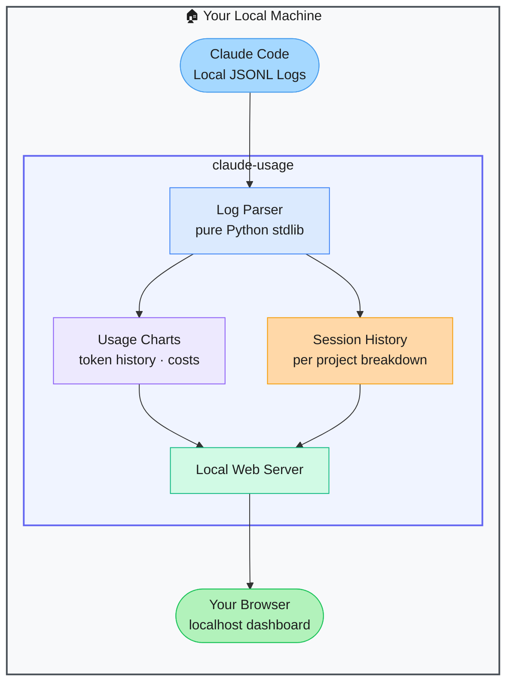

# claude-usage — Local Dashboard for Claude Code Token Usage

> **Repo:** [phuryn/claude-usage](https://github.com/phuryn/claude-usage)
> **Stars:**  | **License:** MIT | **Built by:** phuryn (Product Compass)
> **Runs:** Locally — pure Python stdlib, zero dependencies

---

## What is it?

claude-usage reads Claude Code's local JSONL usage logs and renders a local web dashboard showing token consumption, cost estimates, session history, and project breakdowns. No pip dependencies, no third-party services — everything stays on your machine.

---

## The Problem It Solves

| No Usage Visibility | claude-usage |
|--------------------|--------------|
| Claude Code shows minimal usage info during sessions | Full historical dashboard with charts and session breakdowns |
| No easy way to see cumulative cost across projects | Cost estimates per session, project, and model |
| Max/Pro plan holders can't see how much of their limit they've used | Progress bar for subscription plan usage |

---

## How It Works

Claude Code writes detailed JSONL logs locally. This tool reads them directly, builds charts and breakdowns in memory, and serves a dashboard on localhost. Nothing is sent anywhere.

---

## Core Features

| Feature | What It Does |
|---------|--------------|
| Zero dependencies | Pure Python standard library — no pip install needed |
| Token usage charts | Visual history of token consumption over time |
| Cost estimates | Dollar estimates per session and project |
| Session history | Full log of past sessions with model and project breakdown |
| Plan progress bar | Shows usage against Max/Pro subscription limits |
| Fully local | No data ever leaves your machine |

---

## Real-World Use Cases

| Scenario | What You See |
|----------|-------------|
| Monthly cost review | Total spend across all Claude Code sessions |
| Per-project breakdown | Which project is burning the most tokens |
| Max plan tracking | How much of the monthly limit has been used |

---

## When to Use It

**Good fit:**
- Claude Code users on Pro or Max plans who want to understand their usage patterns
- Developers tracking cost across multiple projects
- Anyone who has wondered "how much have I actually spent on Claude Code?"

**Not the right tool:**
- Anthropic API users (this reads CLI logs, not API billing data)
- Real-time monitoring during active sessions (it's a historical view)
