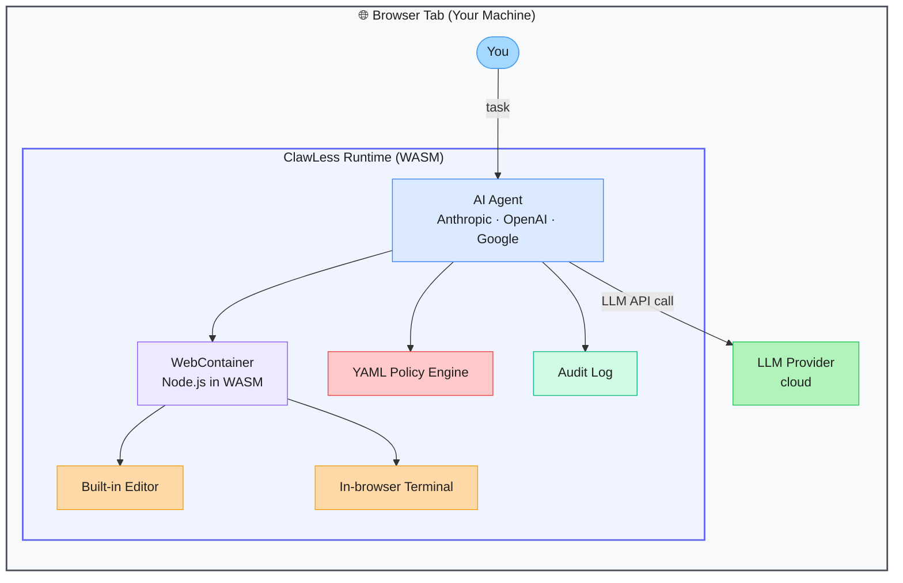

# ClawLess — Serverless Browser-Native AI Agent Runtime

> **Repo:** [open-gitagent/clawless](https://github.com/open-gitagent/clawless)
> **Stars:**  | **License:** MIT | **Built by:** Shreyas Kapale / Lyzr
> **Runs:** Entirely in the browser — no backend server required

---

## What is it?

ClawLess is a serverless runtime that runs AI agents entirely inside a browser tab using WebContainers (WASM). It spins up a real Node.js environment client-side, so agents can execute code, install npm packages, and use tools — without any backend infrastructure.

---

## The Problem It Solves

| Without ClawLess | With ClawLess |
|-----------------|---------------|
| AI agents need backend servers to execute code | Agents run fully in the browser via WASM |
| Deploying agent infrastructure takes days | Share a URL — anyone runs your agent instantly |
| Code execution risks leaking sensitive data to a server | Everything stays in the user's browser sandbox |
| Building agent runtimes requires complex DevOps | Zero-infrastructure, zero-config deployment |

---

## How It Works

WebContainers (StackBlitz's WASM tech) boot a full Node.js runtime inside the browser. ClawLess puts an AI agent on top, wires it to your LLM of choice, and wraps execution with a YAML-based policy engine and audit trail.

---

## Core Features

| Feature | What It Does |
|---------|--------------|
| Browser-native execution | Full Node.js runtime in WASM — no server needed |
| Multi-provider AI | Anthropic, OpenAI, Google backends configurable |
| YAML policy engine | Define what agents are allowed/forbidden to do |
| Audit logging | Every agent action recorded for review |
| GitHub integration | Clone and work on real repos from the browser |
| Plugin lifecycle hooks | Extend agent behaviour with before/after hooks |

---

## Real-World Use Cases

| Scenario | What You Do |
|----------|-------------|
| Demo an AI agent to a client | Share one URL — they click and it runs |
| Sandboxed code execution | Agents run code without touching your servers |
| Internal tooling | Deploy an agent behind a URL with YAML-enforced limits |
| Education / workshops | Students run agents in a browser with no setup |

---

## When to Use It

**Good fit:**
- Sharing agent demos without deploying backend infrastructure
- Security-sensitive contexts where execution must stay client-side
- Rapid prototyping with zero DevOps overhead

**Not the right tool:**
- Production agents handling large compute workloads (browser WASM has memory limits)
- Agents needing persistent long-running processes
