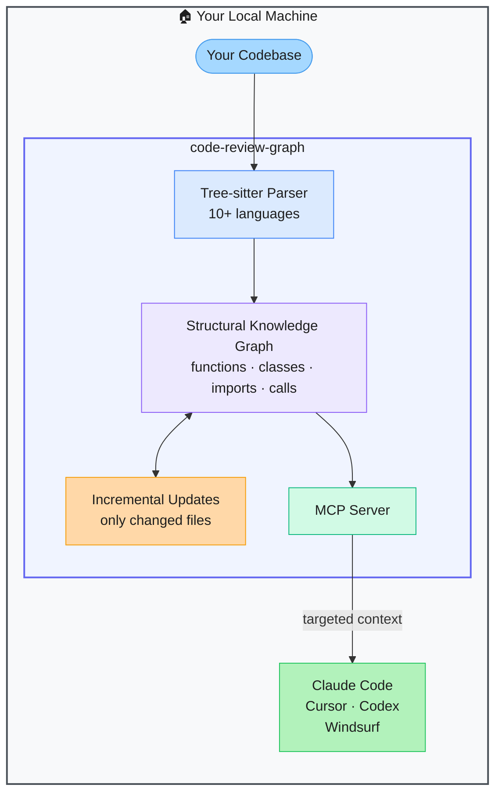

# code-review-graph — Structural Knowledge Graph MCP Server for Codebases

> **Repo:** [tirth8205/code-review-graph](https://github.com/tirth8205/code-review-graph)
> **Stars:**  | **License:** MIT | **Built by:** tirth8205
> **Runs:** Locally — MCP server; integrates with Claude Code, Cursor, Codex, Windsurf

---

## What is it?

code-review-graph builds a persistent structural knowledge graph of your codebase using Tree-sitter — functions, classes, imports, call relationships — and exposes it as an MCP server. AI coding tools query it to get targeted, relevant context instead of re-reading the entire codebase on every task. Average 6.8x token reduction.

---

## The Problem It Solves

| AI Tools Reading Full Codebases | code-review-graph |
|--------------------------------|------------------|
| Re-reads all files on every task — wastes tokens | Builds once, queries incrementally — only changed files re-parsed |
| Context window limits how much code the agent can see | Structural graph surfaces only relevant symbols and files |
| No understanding of code relationships | Tracks function calls, imports, class hierarchies |

---

## How It Works

Tree-sitter parses the codebase into a structural graph. The graph updates incrementally when files change. AI tools query the MCP server to get only the context relevant to the current task — reducing tokens by 6.8x on average.

---

## Core Features

| Feature | What It Does |
|---------|--------------|
| Tree-sitter parsing | Accurate structural analysis for 10+ languages |
| Persistent knowledge graph | Functions, classes, imports, call relationships stored and queryable |
| Incremental updates | Only changed files re-parsed — stays fast on large codebases |
| MCP server | Native interface for Claude Code, Cursor, Codex, Windsurf |
| 6.8x token reduction | Targeted context instead of full file dumps |
| One-command install | Auto-configures all supported AI coding platforms |

---

## Real-World Use Cases

| Task | What the Agent Gets |
|------|-------------------|
| Code review | Only the changed functions and their call graph |
| Bug investigation | The function with the bug + everything it calls/imports |
| Refactoring | All callers of the function being changed |

---

## When to Use It

**Good fit:**
- Large codebases where AI tools regularly hit context limits
- Teams using Claude Code, Cursor, or Codex for ongoing development
- Code reviews where precise, targeted context matters more than full files

**Not the right tool:**
- Small projects under ~50 files (overhead isn't worth it)
- First-pass exploration of a brand-new unfamiliar codebase
