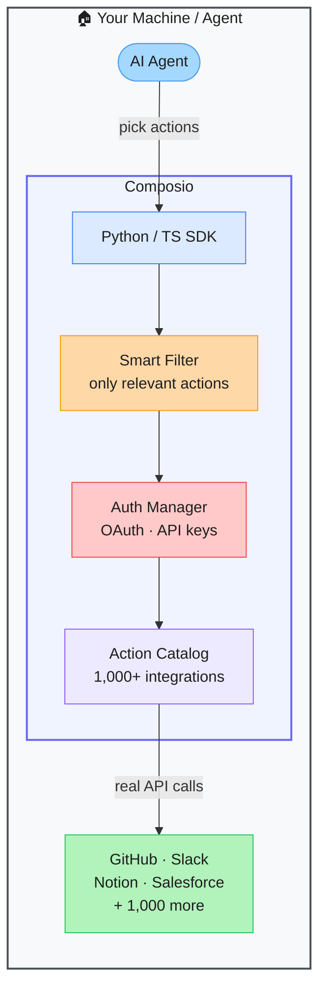

# Composio — 1,000+ Pre-Built Tool Integrations for AI Agents

> **Repo:** [ComposioHQ/composio](https://github.com/ComposioHQ/composio)
> **Stars:**  | **License:** MIT | **Built by:** ComposioHQ
> **Runs:** Cloud-managed auth + local SDK — Python and TypeScript

---

## What is it?

Composio provides 1,000+ pre-built, authenticated tool integrations for AI agents. GitHub, Slack, Notion, Salesforce, Gmail — all available as agent-ready action schemas with managed OAuth. Connect any agent to any app in minutes without building auth or API glue code.

---

## The Problem It Solves

| Building Tool Integrations Yourself | Composio |
|------------------------------------|---------|
| OAuth flows, token refresh, and error handling per integration | All auth managed — you never touch OAuth |
| Writing API schemas so the LLM understands available actions | 1,000+ pre-built schemas, agent-ready |
| Context window overflows when exposing many tools | Smart tool filtering — only relevant actions surface |
| Testing integrations before shipping is manual | Built-in sandbox workbench |

---

## How It Works

Pick actions from the catalog. Composio handles auth behind the scenes. Smart filtering ensures the LLM only sees actions relevant to the current task — avoiding context bloat. Works with LangChain, CrewAI, AutoGen, and OpenAI Agents SDK out of the box.

---

## Core Features

| Feature | What It Does |
|---------|--------------|
| 1,000+ integrations | GitHub, Slack, Notion, Salesforce, Gmail, Jira, and more |
| Managed auth | OAuth and API key handling — zero auth code to write |
| Smart action filtering | Only relevant tools surfaced to the model |
| Sandbox workbench | Test integrations before connecting to production |
| Multi-framework | LangChain, CrewAI, AutoGen, OpenAI Agents SDK, and more |
| Self-hostable | Run on your own infra for full credential control |

---

## Real-World Use Cases

| Task | What Composio Enables |
|------|----------------------|
| GitHub agent | Create PRs, review code, manage issues — no OAuth setup |
| Slack assistant | Read messages, post updates, create channels |
| CRM automation | Read and update Salesforce records from agent workflows |
| Email agent | Read, reply, and organise Gmail — fully authenticated |

---

## When to Use It

**Good fit:**
- Agents that need to interact with multiple external SaaS tools
- Teams who want production-ready integrations without building auth infrastructure
- Any project where "connect to X" would otherwise take days

**Not the right tool:**
- In-house APIs (you control the auth — no need for Composio)
- Data-sensitive environments where managed auth is not acceptable
