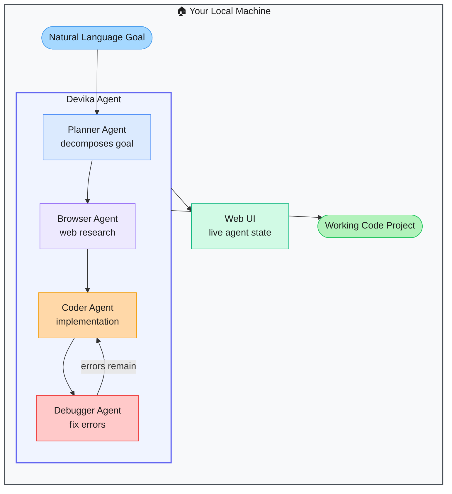

# Devika — Open-Source Agentic Software Engineer

> **Repo:** [stitionai/devika](https://github.com/stitionai/devika)
> **Stars:**  | **License:** MIT | **Built by:** stitionai
> **Runs:** Locally via Python — web UI included

---

## What is it?

Devika is an open-source Devin-like agent. Give it a natural language software spec and it plans, researches the web, writes code, and debugs — delivering a complete working project. A web UI shows the agent's state at every step so you always know what it's doing.

---

## The Problem It Solves

| Without Devika | With Devika |
|---------------|-------------|
| AI code assistants need you to direct every step | Devika decomposes goals autonomously: plan → research → code → debug |
| No open-source alternative to Devin | Full open-source, self-hostable agentic engineer |
| No visibility into what the agent is doing | Web UI shows live agent state at every stage |

---

## How It Works

The planner decomposes the goal into research queries and coding tasks. The browser agent researches libraries and APIs. The coder writes the implementation. The debugger iterates on errors. All visible in the web UI.

---

## Core Features

| Feature | What It Does |
|---------|--------------|
| Multi-agent pipeline | Planner → research → code → debug agents in sequence |
| Browser research | Looks up docs, examples, and libraries during development |
| Live web UI | See exactly what the agent is doing and why |
| Multi-LLM | GPT-4, Claude, Gemini, and local models |
| Project context | Maintains context across the full session |
| Extensible | Add new specialist agents to the pipeline |

---

## Real-World Use Cases

| Input | Output |
|-------|--------|
| "Build a Python web scraper for job listings" | Complete scraper with parsing, storage, and error handling |
| "Create a Discord bot that tracks crypto prices" | Full bot with API calls, formatting, and command handlers |
| "Build a CLI tool to batch resize images" | Working CLI with argument parsing and progress display |

---

## When to Use It

**Good fit:**
- Prototyping complete projects from a plain-language description
- Tasks requiring web research as part of the implementation process
- Developers who want a visual window into the agent's decision-making

**Not the right tool:**
- Production-critical software requiring expert code review
- Tasks with sensitive data (runs locally but browser agent makes web requests)
