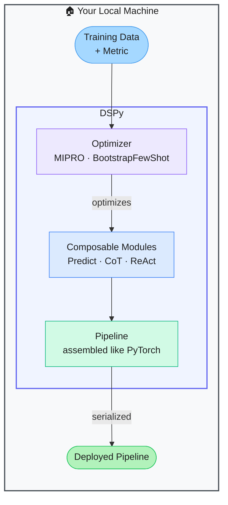

# DSPy — Programming, Not Prompting, Language Models

> **Repo:** [stanfordnlp/dspy](https://github.com/stanfordnlp/dspy)
> **Stars:**  | **License:** MIT | **Built by:** Stanford NLP
> **Runs:** Locally via Python — any LLM backend

---

## What is it?

DSPy replaces hand-crafted prompt strings with composable Python modules whose parameters are automatically optimized. Instead of tweaking prompts by hand, you define what you want (typed signatures) and a DSPy optimizer finds the best prompts, few-shot examples, or fine-tuning weights to achieve it.

---

## The Problem It Solves

| Manual Prompting | DSPy |
|-----------------|------|
| Prompts are brittle — small changes break performance | Modules have typed signatures that survive model and task changes |
| Prompts don't transfer across models | Optimizer tunes for whatever backend you're using |
| Few-shot examples are hand-selected and go stale | Bootstrapped automatically from your training data |
| Pipeline changes require re-prompting everything | Composable modules — change one without rewriting others |

---

## How It Works

You define modules with typed input/output signatures (e.g., `question -> answer`). Chain them into a pipeline. Provide a training set and a metric. The optimizer searches for the best prompt instructions and few-shot examples automatically.

---

## Core Features

| Feature | What It Does |
|---------|--------------|
| Typed signatures | Declare input/output contracts — no raw prompt strings |
| Built-in modules | Predict, ChainOfThought, ReAct, Retrieve, and more |
| Automatic optimization | MIPRO, BootstrapFewShot optimize prompts and examples |
| Composable pipelines | Chain modules like PyTorch layers |
| Fine-tuning support | Optimizer can output fine-tuning data, not just prompts |
| Backend-agnostic | Any LLM — swap without changing pipeline code |

---

## Real-World Use Cases

| Task | DSPy Approach |
|------|--------------|
| RAG pipeline | Retrieve module + CoT module, optimized end-to-end |
| Classification | Predict module with auto-optimized instructions |
| Multi-hop QA | Chain multiple Predict/CoT modules; optimizer tunes all at once |
| Replacing a prompt-heavy codebase | Replace brittle prompt strings with typed DSPy modules |

---

## When to Use It

**Good fit:**
- Projects where prompt quality directly affects business outcomes
- Multi-step LLM pipelines that need consistent performance
- Teams tired of manually tuning prompts every time the model changes

**Not the right tool:**
- One-off prototypes where a quick prompt is good enough
- Simple single-turn tasks that don't benefit from optimization
