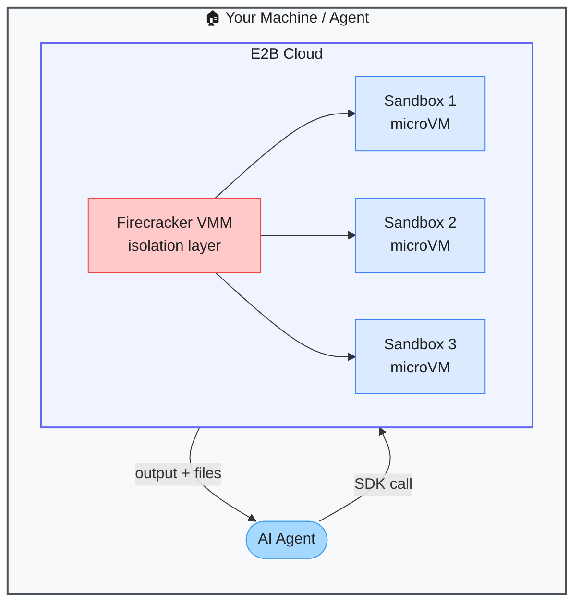

# E2B — Secure Cloud Sandboxes for AI-Generated Code

> **Repo:** [e2b-dev/E2B](https://github.com/e2b-dev/E2B)
> **Stars:**  | **License:** Apache 2.0 | **Built by:** e2b-dev
> **Runs:** Cloud-hosted microVMs (Firecracker) — Python and JS/TS SDKs

---

## What is it?

E2B provides isolated, fast-boot microVM sandboxes where AI agents can safely run arbitrary code. Each sandbox is a full Linux environment that boots in ~150ms, has internet access, and can install packages — with complete isolation so nothing escapes to the host.

---

## The Problem It Solves

| Running AI Code on Host Machine | E2B Sandboxes |
|--------------------------------|---------------|
| Arbitrary code execution is a security risk | Firecracker microVMs isolate every sandbox completely |
| Setting up a safe execution environment is complex | `sandbox = Sandbox()` — one line, running in 150ms |
| Agent state is lost between tool calls | Persistent filesystem across all steps in a session |

---

## How It Works

Your agent calls the E2B SDK. A microVM boots in ~150ms. The agent runs code, installs packages, reads/writes files. The sandbox persists across multiple tool calls in a session. When done, it's destroyed — nothing persists to the host.

---

## Core Features

| Feature | What It Does |
|---------|--------------|
| Firecracker microVMs | Complete isolation — nothing escapes to the host |
| ~150ms cold start | Near-instant sandbox provisioning |
| Persistent filesystem | State preserved across all agent steps in a session |
| Internet access | Agents can install packages and fetch data |
| Python + JS/TS SDKs | Integrate in any language |
| Custom OS images | Bring your own base image with pre-installed deps |

---

## Real-World Use Cases

| Use Case | Why E2B |
|----------|---------|
| Code interpreter feature | Users run AI-generated code safely (think ChatGPT Code Interpreter) |
| Agent tool execution | Agent writes a script, E2B runs it, returns the result |
| CI for AI-generated code | Every PR runs generated code in isolation before merging |
| Data analysis | Agent processes uploaded files in a sandboxed Python environment |

---

## When to Use It

**Good fit:**
- Any AI app where users or agents execute code that you didn't write
- Building a Code Interpreter-style feature in your product
- Agents that need to install packages and run code as part of their workflow

**Not the right tool:**
- Long-running persistent workloads (sandboxes are ephemeral)
- Air-gapped environments (E2B is a cloud service)
