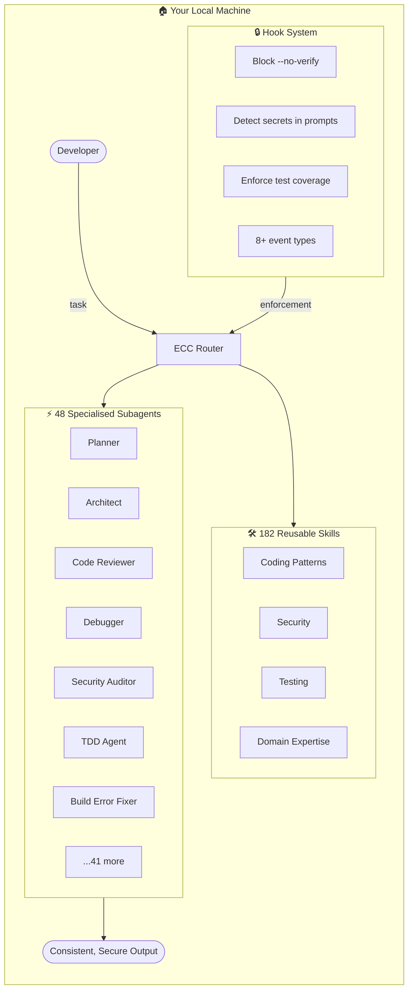

# Everything Claude Code — Complete Performance System for AI Coding Agents

> **Repo:** [affaan-m/everything-claude-code](https://github.com/affaan-m/everything-claude-code)
> **Stars:** 140k+ | **License:** MIT | **Built by:** Affaan Mustafa
> **Runs:** Claude Code, Cursor, Codex, OpenCode (cross-platform)

---

## What is it?

Everything Claude Code (ECC) is a comprehensive plugin that makes AI coding agents consistent, secure, and predictable — 48 subagents, 182 skills, and intelligent hooks enforcing structured behaviour across every project.

## The Problem It Solves

AI coding agents are powerful but inconsistent. They skip tests, circumvent linters, modify configs incorrectly, and drift between sessions. ECC treats agent consistency as an engineering problem: opinionated rules, specialised subagents per task type, and hook-based enforcement so the agent can't cut corners.

Won an Anthropic hackathon (Cerebral Valley × Anthropic, February 2026) and hit 100k+ stars within months.

## How It Works



**Core architecture:**
- **Plugin-based** — installs via Claude Code marketplace or manual copy into `.claude/`
- **Auto-loading** — components activate based on task context, not manual invocation
- **Hook enforcement** — 8+ event hooks block unsafe actions before they execute
- **AgentShield** — 1,282 security tests + 102 static analysis rules; `--opus` flag runs red-team/blue-team/auditor mode

## Core Features

- **48 specialist subagents** — one for each task type: planning, architecture, TDD, security review, build error resolution, debugging, code review, and more
- **182 reusable skills** — copy-paste workflows covering coding patterns, security, testing, and domain expertise across 10+ languages
- **68 legacy command shims** — backward compatibility layer so old workflows keep working
- **AgentShield security scanner** — 1,282 automated tests, 102 static rules, adversarial red-team mode
- **Hook-based enforcement** — blocks `--no-verify` flags, detects secrets accidentally included in prompts
- **MCP server configs** — pre-wired integrations for external tools
- **Desktop dashboard** — GUI for exploring and activating components
- **Token optimisation** — built-in guidance to reduce LLM API costs
- **Multi-language** — TypeScript, Python, Go, Swift, PHP, Java, Kotlin, Rust, Perl, C++

## Real-World Use Cases

- **Team standardisation** — every developer's AI agent follows the same quality gates and workflow
- **Security enforcement** — AgentShield prevents agents from writing vulnerable code or leaking secrets
- **Large multi-language monorepos** — consistent patterns across different language services
- **Automated code review pipelines** — specialist reviewer subagent runs after every change
- **TDD workflows** — dedicated test-driven agent writes tests before implementation
- **Token cost reduction** — structured responses and token-optimisation skills lower API bills

## When to Use It

**Use Everything Claude Code when:**
- You want systematic, opinionated AI workflows rather than ad hoc prompting
- Your team needs consistent standards enforced across all AI-assisted development
- Security scanning and testing gates must be non-negotiable
- You're managing multi-language or multi-service projects requiring uniform quality
- Token costs are a concern and you need built-in optimisation

**Skip it when:**
- You prefer minimal, un-opinionated setups with full manual control
- Your project is small and one-off with no consistency requirements
- You're experimenting and don't need guardrails yet

**Setup:**
```
/plugin marketplace add affaan-m/everything-claude-code
```
Or clone and copy the `.claude/` folder into your project. Works with Claude Code, Cursor, Codex, and OpenCode.
