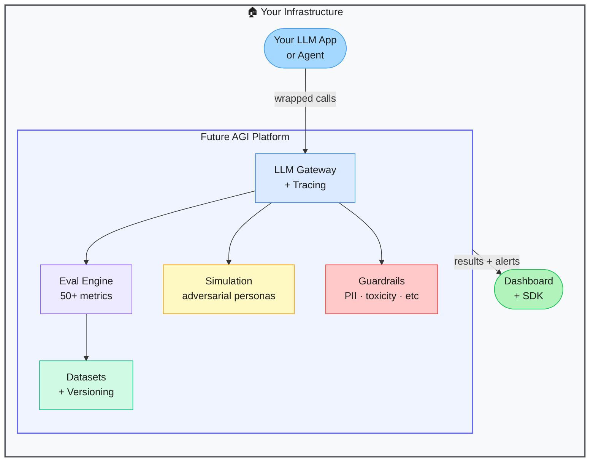

# Future AGI — LLM Evaluation & Observability Platform

> **Repo:** [future-agi/future-agi](https://github.com/future-agi/future-agi)
> **Stars:**  | **License:** Apache 2.0 | **Built by:** FutureAGI Inc.
> **Runs:** Self-hosted via Docker/Kubernetes, or cloud-managed

---

## What is it?

Future AGI is an open-source platform for evaluating, tracing, and continuously improving LLM applications and AI agents. It wraps your LLM calls with observability, runs 50+ automated eval metrics, simulates adversarial conversations, and enforces guardrails — all in one self-hostable platform.

---

## The Problem It Solves

| Without Future AGI | With Future AGI |
|--------------------|-----------------|
| LLM apps hallucinate silently — no systematic detection | 50+ automated eval metrics catch issues every run |
| Agent quality degrades over time with no alerts | Continuous evaluation with regression tracking |
| No visibility into what agents actually did | Full trace of every LLM call, tool use, and decision |
| Testing against adversarial inputs is manual | Built-in simulation of multi-turn adversarial conversations |

---

## How It Works

You instrument your LLM calls with the SDK. Every call flows through the gateway, gets traced, evaluated against your chosen metrics, and checked by guardrails. Results land in the dashboard with trend tracking across versions.

---

## Core Features

| Feature | What It Does |
|---------|--------------|
| Tracing | Full call-level visibility — inputs, outputs, latency, cost, tool use |
| 50+ eval metrics | Groundedness, relevance, faithfulness, PII detection, toxicity, and more |
| Simulation | Spin up adversarial AI personas to stress-test agents in multi-turn conversations |
| Guardrails | 18 built-in inline checks — block bad outputs before they reach users |
| Datasets | Version and manage eval datasets alongside your app code |
| Python + TS SDKs | Drop-in instrumentation for existing LLM apps |

---

## Real-World Use Cases

| Scenario | What You Get |
|----------|--------------|
| RAG pipeline quality check | Groundedness and faithfulness scores per retrieval |
| Agent regression testing | Catch when a model update breaks agent behaviour |
| Compliance / PII safety | Block PII from ever leaving the system |
| Red-teaming | Adversarial simulations before production launch |

---

## When to Use It

**Good fit:**
- Teams shipping LLM apps who need systematic quality control
- Regulated industries requiring PII and toxicity guardrails
- Anyone doing A/B testing across model versions

**Not the right tool:**
- One-off prototypes not heading to production
- Simple single-turn chatbots with no safety requirements
