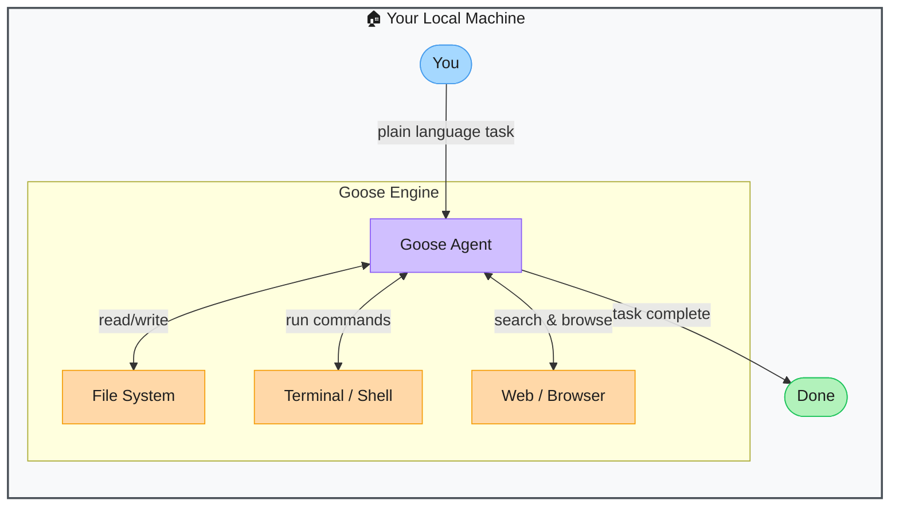

# Goose — Open-Source Autonomous AI Coding Agent

> **Repo:** [block/goose](https://github.com/block/goose)
> **Stars:** 13k+ | **License:** Apache 2.0 | **Built by:** Block (formerly Square)
> **Runs:** Locally on your machine — no code leaves unless you push it

---

## Try It — No Install Required

Click the badge above → GitHub spins up a browser-based VS Code with Goose pre-installed.

**Steps after it opens:**
1. Open the terminal (`Ctrl+`` `)
2. Run `goose session`
3. Enter your LLM API key when prompted (Anthropic, OpenAI, or Gemini)
4. Give Goose a task — it runs right there in the browser

> You only need an API key. No local install, no dependency setup.

---

## What is it?

Goose is an open-source AI agent that takes a plain-language task from you, then autonomously plans, writes code, runs shell commands, reads/writes files, and browses the web until the task is done — without you babysitting each step.

---

## The Problem It Solves

| Without Goose | With Goose |
|---------------|------------|
| You write code, run it, read the error, fix it, repeat | Goose runs the whole loop on its own |
| Context-switching between editor, terminal, browser, and docs | One instruction — Goose handles all the tool calls |
| AI chat tools give snippets you still paste, run, and debug | Goose executes against your real codebase and fixes its own mistakes |
| Cloud agents send your code to a remote server | Runs 100% locally — your code stays on your machine |

---

## How It Works

Goose runs a loop internally:

**plan → act → observe → adjust → repeat until done**

1. You give it a task: *"Add rate limiting to my Express app"*
2. Goose plans the steps
3. Searches npm docs, picks a library, installs it, edits your files
4. Runs your tests — if they fail, it reads the error and fixes it
5. Reports back when complete

[Open interactive diagram on Excalidraw](https://excalidraw.com/#json=0bTTvx0Hogauau6i0EJaA,TRSUmv1A9HiUTj7hkI6YEQ)

---

## Core Features

| Feature | What It Does |
|---------|--------------|
| Shell execution | Runs terminal commands — installs packages, runs tests, starts servers |
| File read/write | Reads your existing code for context; writes and edits files directly |
| Web browsing | Searches docs, Stack Overflow, GitHub issues when it needs info |
| Multi-model | Works with Claude, GPT-4, Gemini, Llama (via Ollama) |
| MCP extensions | Connect databases, APIs, and custom tools via Model Context Protocol |
| Free to use | No Goose subscription — you only pay for the LLM API you connect |

---

## Real-World Use Cases

| Task | What You Say | What Goose Does |
|------|-------------|-----------------|
| Scaffold a project | "Create a Node.js REST API with auth and Postgres" | Creates files, installs deps, writes routes, sets up DB schema |
| Debug failing tests | "Fix the broken tests in /tests/auth.test.ts" | Reads test + source, finds the bug, edits source, re-runs tests |
| Research + implement | "Add rate limiting to my Express app" | Searches npm, picks a library, installs it, wires it in |
| Refactor | "Migrate all fetch() calls in /src to axios" | Reads all files, rewrites them, verifies nothing was missed |
| DevOps | "Write a GitHub Actions CI workflow" | Creates `.github/workflows/ci.yml` with correct config |

---

## When to Use It

**Good fit:**
- Tasks with many mechanical steps (scaffold, migrate, refactor, debug)
- You want AI that runs and verifies its own output — not just suggests
- You need full local control (nothing sent to the cloud)

**Not the right tool:**
- Real-time pair programming while you type (use Cursor for that)
- Tasks needing deep architectural judgment calls
- Environments where running arbitrary shell commands is a risk

