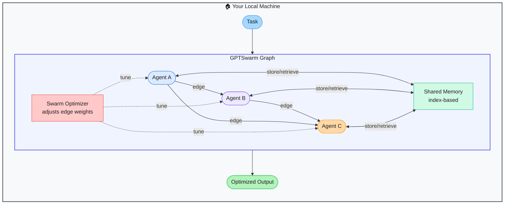

# GPTSwarm — Self-Optimizing Graph-Based Agent Swarms

> **Repo:** [metauto-ai/GPTSwarm](https://github.com/metauto-ai/GPTSwarm)
> **Stars:**  | **License:** MIT | **Built by:** metauto-ai
> **Runs:** Locally via Python

---

## What is it?

GPTSwarm represents multi-agent systems as optimizable graphs — agents are nodes, communication is edges. Unlike static pipelines, the swarm can self-organize and learn which agent connections and configurations work best for a given task via a built-in optimizer. ICML 2024 Oral paper.

---

## The Problem It Solves

| Static Agent Pipelines | GPTSwarm |
|------------------------|---------|
| Fixed connections can't adapt to new task types | Graph structure is learnable and self-optimizable |
| No feedback on which agent combinations perform best | Swarm optimizer tunes edge weights based on task performance |
| Manual tuning of agent topology is guesswork | Automatic self-organization via reinforcement-style optimization |

---

## How It Works

Agents are graph nodes, edges represent communication paths. The optimizer adjusts edge weights and agent compositions based on task outcomes — the swarm learns better configurations over time.

---

## Core Features

| Feature | What It Does |
|---------|--------------|
| Graph-based architecture | Agents as nodes, communication as optimizable edges |
| Swarm optimizer | Automatically tunes agent topology for better performance |
| Self-organization | Swarm learns which connections matter per task type |
| Shared memory | Index-based memory accessible across all agents |
| Visualization | Inspect the agent graph and edge weights |
| Multi-domain | Coding, QA, web tasks supported |

---

## Real-World Use Cases

| Task | What the Swarm Does |
|------|-------------------|
| Complex QA | Multiple agents gather different information; optimizer learns best routing |
| Code generation | Swarm of specialist agents (design, implement, review) self-arranges |
| Research tasks | Agents with different retrieval strategies collaborate via optimized edges |

---

## When to Use It

**Good fit:**
- Research into self-optimizing multi-agent systems
- Tasks where the optimal agent topology is unknown upfront
- Projects that benefit from emergent agent coordination

**Not the right tool:**
- Production apps needing stable, predictable pipelines
- Simple tasks where a single agent suffices
