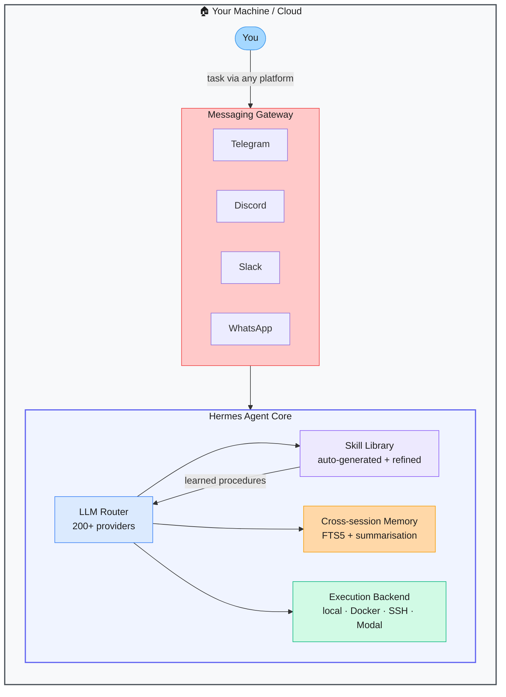

# Hermes Agent — Self-Improving Autonomous AI Agent

> **Repo:** [NousResearch/hermes-agent](https://github.com/NousResearch/hermes-agent)
> **Stars:**  | **License:** MIT | **Built by:** Nous Research
> **Runs:** Locally or in the cloud — supports local/Docker/SSH/Daytona/Modal/Singularity backends

---

## What is it?

Hermes Agent is an autonomous AI agent that builds and refines a personal skill library from experience. After completing a complex task, it auto-generates a reusable procedural skill. Each skill improves with subsequent use. It supports 200+ LLM providers and connects to Telegram, Discord, Slack, WhatsApp, Signal, and more through a single gateway.

---

## The Problem It Solves

| Standard AI Agents | Hermes Agent |
|-------------------|--------------|
| Every session starts from scratch — no learning | Builds a persistent skill library that grows with use |
| Long conversation history floods the context window | FTS5 + LLM summarisation gives cross-session memory without bloating context |
| Single platform only | One agent accessible from Telegram, Discord, Slack, WhatsApp, Signal |
| Locked to one LLM provider | 200+ providers via OpenRouter |

---

## How It Works

When Hermes completes a novel task, it reflects on what it did and writes a procedural skill (a reusable description of how to do it). On the next similar task, it retrieves the relevant skill from memory and executes faster and more accurately. Skills self-improve on each use.

---

## Core Features

| Feature | What It Does |
|---------|--------------|
| Self-improving skills | Auto-generates and refines procedural skills from task experience |
| Persistent memory | Cross-session memory without flooding the context window |
| 6 execution backends | Local shell, Docker, SSH, Daytona, Singularity, Modal |
| 200+ model providers | Any LLM via OpenRouter — swap without changing agent logic |
| Multi-platform messaging | Single gateway for Telegram, Discord, Slack, WhatsApp, Signal |
| Scheduled automations | Set recurring tasks the agent runs on a schedule |

---

## Real-World Use Cases

| Scenario | What Hermes Does |
|----------|-----------------|
| Recurring research tasks | Learns how you like research presented; improves each time |
| Personal assistant on Telegram | One bot handles tasks across all your messaging apps |
| Automated workflows | Schedule daily or weekly tasks the agent runs autonomously |
| Code and dev tasks | Learns your codebase patterns; gets faster on repeated task types |

---

## When to Use It

**Good fit:**
- Power users wanting a personal AI agent that genuinely gets better over time
- Multi-platform usage — one agent accessible from all your messaging apps
- Recurring tasks where accumulated skill makes a real difference

**Not the right tool:**
- One-off tasks where no learning value accumulates
- Environments requiring a deterministic, stateless agent
