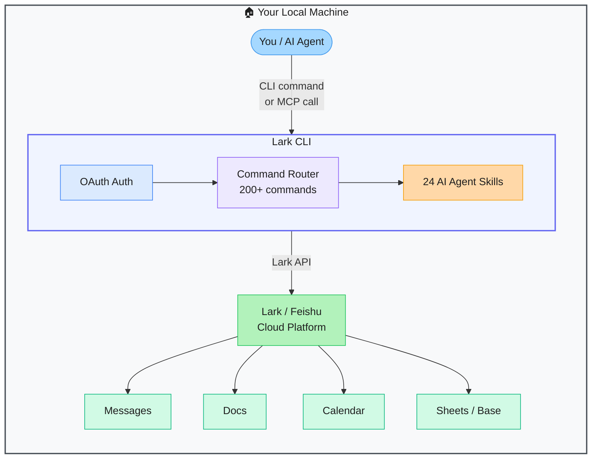

# Lark CLI — Official Lark/Feishu Command-Line Interface for Humans and AI Agents

> **Repo:** [larksuite/cli](https://github.com/larksuite/cli)
> **Stars:**  | **License:** MIT | **Built by:** Lark/Feishu (ByteDance)
> **Runs:** Locally as a CLI or as an MCP server — macOS, Linux, Windows

---

## What is it?

Lark CLI is the official command-line interface for the Lark/Feishu collaboration platform. It covers 200+ commands across messaging, docs, calendar, sheets, tasks, and meetings — and doubles as an MCP server so AI agents can act on Lark directly from tools like Claude Desktop or Cursor.

---

## The Problem It Solves

| Without Lark CLI | With Lark CLI |
|-----------------|---------------|
| Accessing Lark from automation scripts requires writing OAuth + API glue code | 200+ ready-made commands, auth handled |
| AI agents can't interact with Lark without custom integrations | Drop-in MCP server — any MCP client connects instantly |
| Manual tasks in the Lark UI are not scriptable | Full CLI coverage of messages, docs, sheets, calendar, tasks, meetings |

---

## How It Works

Install once, authenticate via OAuth, then call any command from the terminal or wire it up as an MCP server. The 24 built-in AI Agent Skills are pre-packaged multi-step workflows for common Lark tasks.

---

## Core Features

| Feature | What It Does |
|---------|--------------|
| 200+ commands | Full coverage: Messenger, Docs, Sheets, Base, Calendar, Mail, Tasks, Meetings |
| 24 AI Agent Skills | Pre-built multi-step workflows for common tasks |
| MCP server mode | Run as `lark mcp` — any MCP client connects and gains Lark superpowers |
| Table output | Structured, readable terminal output with column filtering |
| Dry-run mode | Preview what a command will do before executing |
| Smart defaults | Sensible defaults reduce flags needed for common operations |

---

## Real-World Use Cases

| Task | Command Style |
|------|--------------|
| Send a message to a channel | `lark message send --channel #general --text "Deploy done"` |
| Create a doc from a template | `lark doc create --template meeting-notes` |
| List today's calendar events | `lark calendar list --date today` |
| Let Claude manage your Lark | Add as MCP server → Claude reads/sends messages, creates tasks |

---

## When to Use It

**Good fit:**
- Automating Lark tasks from scripts or CI/CD pipelines
- Giving AI agents (Claude, Cursor) the ability to interact with Lark
- Teams where Lark is the primary collaboration tool and want terminal-first workflows

**Not the right tool:**
- You don't use Lark/Feishu (Slack/Teams users have no benefit here)
- GUI-driven workflows where the Lark web app is sufficient
