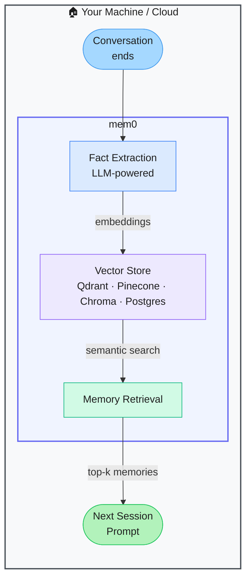

# mem0 — Universal Memory Layer for AI Agents

> **Repo:** [mem0ai/mem0](https://github.com/mem0ai/mem0)
> **Stars:**  | **License:** Apache 2.0 | **Built by:** mem0ai
> **Runs:** Self-hosted or cloud — Python and TypeScript SDKs

---

## What is it?

mem0 is a universal memory layer for AI agents and assistants. It stores, retrieves, and updates facts about users, sessions, and agents across conversations — using semantic search over a vector store. Any LLM app can add persistent, user-adaptive memory in minutes.

---

## The Problem It Solves

| LLMs Without Memory | With mem0 |
|--------------------|-----------|
| Every session starts from scratch — no continuity | Relevant memories injected automatically into each new session |
| Context window fills up with repeated background info | Only the most relevant memories are retrieved and used |
| Building a memory layer requires custom infra | Simple `add / search / get_all` API wraps any vector store |

---

## How It Works

At session end, key facts are extracted from the conversation and stored as embeddings. At session start, a semantic search retrieves the most relevant memories and injects them into the prompt. Namespacing keeps user, agent, and session memories separate.

---

## Core Features

| Feature | What It Does |
|---------|--------------|
| Simple API | `add()`, `search()`, `get_all()` — three methods cover everything |
| Multi-level namespacing | Per-user, per-agent, per-session memory buckets |
| Semantic search | Vector similarity retrieval — finds relevant memories, not just keyword matches |
| Pluggable backends | Qdrant, Pinecone, Chroma, PostgreSQL, and more |
| Auto fact extraction | LLM extracts salient facts from conversations automatically |
| Hosted + self-hostable | Cloud option for zero-ops or fully self-hosted for data control |

---

## Real-World Use Cases

| App | What mem0 Adds |
|-----|---------------|
| Customer support bot | Remembers past issues and preferences across sessions |
| Personal AI assistant | Learns your name, habits, and preferences over time |
| Coding agent | Remembers your project structure and conventions |
| Tutoring app | Tracks what each student has learned and struggles with |

---

## When to Use It

**Good fit:**
- Any LLM app that benefits from continuity across sessions
- Personalisation — making the AI feel like it actually knows the user
- Agents that should learn and adapt from repeated use

**Not the right tool:**
- Stateless, single-session applications (no memory needed)
- Compliance environments where storing user data is restricted
