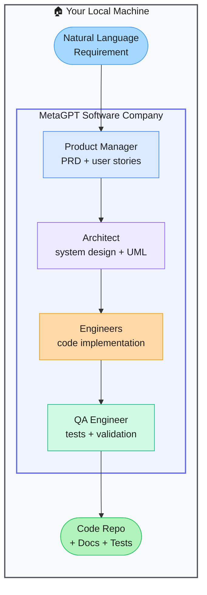

# MetaGPT — The Software Company in a Prompt

> **Repo:** [FoundationAgents/MetaGPT](https://github.com/FoundationAgents/MetaGPT)
> **Stars:**  | **License:** MIT | **Built by:** FoundationAgents (formerly DeepWisdom)
> **Runs:** Locally via Python

---

## What is it?

MetaGPT simulates a software company using LLM agents. One prompt in — a natural language software requirement — and specialized agents (Product Manager, Architect, Engineer, QA) collaborate through structured handoffs to produce a complete, working software project.

---

## The Problem It Solves

| Manual Development | MetaGPT |
|-------------------|---------|
| Writing PRDs, system design, code, and tests takes days | Full pipeline from requirement to running code, automated |
| Context gets lost across handoffs between roles | Structured documents passed between agents preserve context |
| One LLM produces inconsistent architecture decisions | Role-specialized agents each focus on their domain |

---

## How It Works

Each agent only sees the structured output of the previous role — mimicking a real company's review chain. Standardized Operating Procedures (SOPs) coordinate the flow. Outputs include code, UML diagrams, and test suites.

---

## Core Features

| Feature | What It Does |
|---------|--------------|
| Role-based agent society | PM, Architect, Engineer, QA agents with distinct responsibilities |
| SOPs as coordination | Structured document handoffs ensure context carries through roles |
| Full project generation | Code repo, UML, API docs, test suites from one prompt |
| Incremental development | Supports iterative improvements and code review loops |
| Multi-language output | Generates Python, JavaScript, TypeScript, and more |
| Memory + RAG | Cross-session context for ongoing projects |

---

## Real-World Use Cases

| Input | Output |
|-------|--------|
| "Build a REST API for a todo app with auth" | Full FastAPI project with routes, models, tests, README |
| "Create a data pipeline that processes CSV files" | Python ETL code with error handling and unit tests |
| "Make a browser extension that summarises articles" | JS extension with manifest, content script, popup UI |

---

## When to Use It

**Good fit:**
- Generating a full project scaffold from a high-level spec
- Prototyping where you need PRD + design + code all at once
- Studying multi-role agent coordination for software engineering

**Not the right tool:**
- Small single-file edits (far too much overhead)
- Production-critical code that requires expert human review at every step
