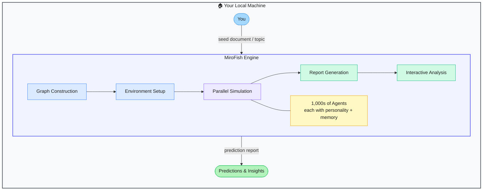

# MiroFish — Swarm Intelligence Prediction Engine

> **Repo:** [666ghj/MiroFish](https://github.com/666ghj/MiroFish)
> **Stars:**  | **License:** AGPL-3.0 | **Built by:** Guo Hangjiang (BaiFu), senior undergrad student, China
> **Runs:** Locally via Docker or source — Python backend + Vue frontend

---

## What is it?

MiroFish is an open-source swarm intelligence engine that builds a simulated parallel world populated by thousands of AI agents — each with a unique personality and memory — to predict how real events will unfold. You feed it a document (news article, policy draft, financial report, novel excerpt), and it simulates the human reaction, social ripple effects, and likely outcomes.

---

## The Problem It Solves

| Without MiroFish | With MiroFish |
|-----------------|---------------|
| Predicting public reaction relies on surveys or gut feel | Simulate thousands of agent personas reacting to your content |
| Financial forecasting is a black box | Run agents through market scenarios and watch emergent behavior |
| Policy drafts go out blind | Test a policy on a synthetic population before it's published |
| Reading novel/story outcomes is subjective | Let agents play it out and generate an evidence-based ending |

---

## How It Works

[Open interactive diagram on Excalidraw](https://excalidraw.com/#json=8hO_8fcT74Z0leTR8Qqma,x6PUqf8UeS7H1OU7sQnNxA)

**Five-stage pipeline:**

1. **Graph Construction** — parses your seed document, extracts entities, relationships, and context
2. **Environment Setup** — builds a digital world with those entities, assigns agent personas and backstories
3. **Parallel Simulation** — thousands of agents interact, form opinions, react, and evolve over simulated time
4. **Report Generation** — engine summarises what emerged: dominant reactions, predicted outcomes, outliers
5. **Interactive Analysis** — you can chat directly with any simulated agent to interrogate their reasoning

---

## Core Features

| Feature | What It Does |
|---------|--------------|
| Swarm agents | Spawns 1,000s of agents, each with unique personality, role, and long-term memory |
| Dynamic variable injection | Change a variable mid-simulation (e.g. raise interest rate) and watch the world react |
| Interactive agent chat | Talk to any agent in the simulation — ask why they behaved as they did |
| Universal input | Works with news, policy docs, financial reports, novels, social media posts |
| Multi-domain prediction | Public opinion, financial forecasting, geopolitical scenarios, story endings |
| Docker-ready | One `docker-compose up` gets the full stack running |

---

## Real-World Use Cases

| Scenario | What You Feed It | What You Get |
|----------|-----------------|--------------|
| Public opinion | Press release or policy draft | Simulated social media reaction from 1,000 agent personas |
| Financial forecast | Earnings report or macro news | Agent-driven market sentiment and likely price direction |
| Geopolitical | Diplomatic document or news event | Predicted cascade of reactions across simulated factions |
| Story/novel | Chapter or plot summary | Agents play out the rest — generates a predicted ending |
| Product launch | Announcement copy | Simulated customer segment reactions before you publish |

---

## MiroFish vs Alternatives

| Tool | Approach | Agent Scale | Local? | Best For |
|------|----------|-------------|--------|---------|
| **MiroFish** | Swarm simulation | 1,000s of agents | Yes | Emergent social, market, and opinion prediction |
| GPT / Claude prompting | Single LLM | 1 | No | Quick gut-check — fast but shallow |
| Traditional surveys | Human respondents | Hundreds | N/A | Real opinions, but slow and expensive |
| LangGraph / CrewAI | Custom agent pipelines | Configurable | Yes | Custom workflows — you build the logic yourself |
| Consensus / Metaculus | Prediction markets | Crowd | No | Aggregated human forecasting |

---

## When to Use It

**Good fit:**
- Stress-testing a message, policy, or decision before it goes public
- Research into emergent social behavior and collective intelligence
- Scenario planning where human surveys are too slow or expensive
- Creative writing — let the simulation finish your story

**Not the right tool:**
- Real-time predictions (simulation takes time to run)
- Tasks needing a single deterministic answer — this produces probabilistic, emergent output
- Environments where running a full Python + Node stack is impractical

---

## Tech Stack

| Layer | Technology |
|-------|-----------|
| Backend | Python 3.11–3.12 |
| Frontend | Vue 3 + Node.js 18+ |
| LLM | OpenAI-compatible APIs (recommends Alibaba Qwen via Bailian) |
| Memory | Zep Cloud (long-term agent memory) |
| Deployment | Docker + docker-compose |
