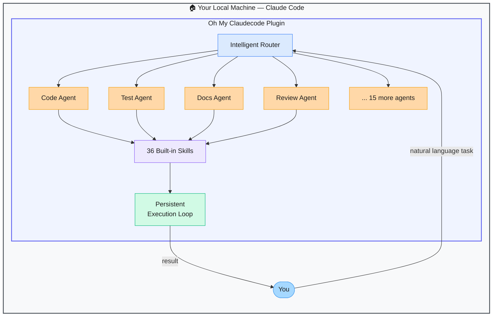

# Oh My Claudecode — Multi-Agent Orchestration Plugin for Claude Code

> **Repo:** [Yeachan-Heo/oh-my-claudecode](https://github.com/Yeachan-Heo/oh-my-claudecode)
> **Stars:**  | **License:** MIT | **Built by:** Yeachan-Heo
> **Runs:** Inside Claude Code — installed via `/plugin marketplace add`

---

## What is it?

Oh My Claudecode turns Claude Code from a single-agent tool into a coordinated multi-agent system. Inspired by the Oh My Zsh plugin philosophy, it installs 19 specialised agents and 36 skills with zero manual configuration — all accessible via natural language inside your existing Claude Code session.

---

## The Problem It Solves

| Stock Claude Code | Oh My Claudecode |
|------------------|-----------------|
| One agent handles everything sequentially | 19 specialised agents work in parallel on different subtasks |
| No built-in task routing | Natural language routes tasks to the right specialist agent automatically |
| Manual orchestration for multi-step workflows | Autopilot mode handles full workflows end-to-end |
| Token-heavy for large parallel tasks | Token-efficient parallel execution model |

---

## How It Works

Install it once from the Claude Code plugin marketplace. From then on, any task you give Claude Code gets intelligently routed to the right specialist agent. The 36 skills cover the most common development workflows — the plugin handles orchestration invisibly.

---

## Core Features

| Feature | What It Does |
|---------|--------------|
| 19 specialised agents | Dedicated agents for code, tests, docs, review, security, and more |
| 36 built-in skills | Pre-packaged multi-step workflows for common dev tasks |
| Intelligent routing | Natural language maps to the right agent automatically |
| Autopilot mode | Full end-to-end workflow execution without step-by-step prompting |
| Token-efficient parallelism | Parallel execution designed to minimise token consumption |
| One-command install | `/plugin marketplace add oh-my-claudecode` |

---

## Real-World Use Cases

| Task | What Happens |
|------|-------------|
| "Add tests for the auth module" | Test agent picks it up, writes, runs, and fixes tests |
| "Review this PR for security issues" | Security review agent runs a focused assessment |
| "Refactor and document the utils folder" | Code + docs agents work in parallel |
| "Ship this feature end-to-end" | Autopilot chains code → test → review → docs agents |

---

## When to Use It

**Good fit:**
- Claude Code users tackling large tasks that benefit from specialisation
- Teams wanting consistent, repeatable dev workflows inside Claude Code
- Anyone who wants autopilot-style multi-agent execution without manual orchestration

**Not the right tool:**
- Non-Claude Code workflows (plugin only works inside Claude Code)
- Simple single-turn questions that don't need multi-agent coordination
