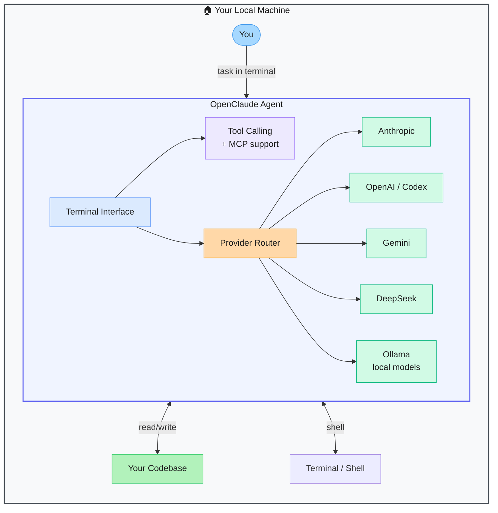

# OpenClaude — Multi-Provider Claude Code Fork

> **Repo:** [Gitlawb/openclaude](https://github.com/Gitlawb/openclaude)
> **Stars:**  | **License:** MIT | **Built by:** Gitlawb
> **Runs:** Locally in the terminal — macOS, Linux, Windows (WSL)

---

## What is it?

OpenClaude is an open-source fork of Claude Code extended to support 200+ LLM providers — OpenAI, Gemini, DeepSeek, Ollama, Codex, GitHub Models, and any OpenAI-compatible API. You get the full Claude Code terminal-agent experience with any model backend.

---

## The Problem It Solves

| Claude Code (original) | OpenClaude |
|------------------------|------------|
| Locked to Anthropic API | 200+ providers via OpenAI-compatible routing |
| Requires an Anthropic account and key | Use OpenAI, Gemini, DeepSeek, local Ollama, or any compatible provider |
| No flexibility for cost or compliance reasons | Switch providers by changing one config value |

---

## How It Works

The agent architecture is identical to Claude Code — terminal-native, tool-calling, streaming, MCP integration, agentic workflows. The provider layer is swapped out so any OpenAI-compatible API can be used as the backend.

---

## Core Features

| Feature | What It Does |
|---------|--------------|
| 200+ model providers | Anthropic, OpenAI, Gemini, DeepSeek, Ollama, GitHub Models, and more |
| Same Claude Code UX | Identical terminal interface and workflow |
| MCP support | Connect MCP servers for external tools |
| Streaming output | Real-time token streaming from any provider |
| Local model support | Ollama integration for air-gapped or cost-free usage |
| MIT licence | Fully open — modify and distribute freely |

---

## Real-World Use Cases

| Scenario | Why OpenClaude |
|----------|---------------|
| You want Claude Code but with GPT-4o | Swap provider, keep the workflow |
| Cost reduction — use DeepSeek or Gemini Flash | Cheaper API, same agent capability |
| Air-gapped environment | Route to local Ollama, no data leaves your machine |
| Testing models side-by-side | Switch config line, compare outputs on same tasks |

---

## When to Use It

**Good fit:**
- Developers who want the Claude Code agent UX but without Anthropic API lock-in
- Cost-conscious teams wanting to benchmark cheaper models on real coding tasks
- Environments where only certain LLM providers are approved

**Not the right tool:**
- Users who prefer the official Claude Code and are happy with Anthropic's API
- Workflows needing Anthropic-specific features not available on other providers
