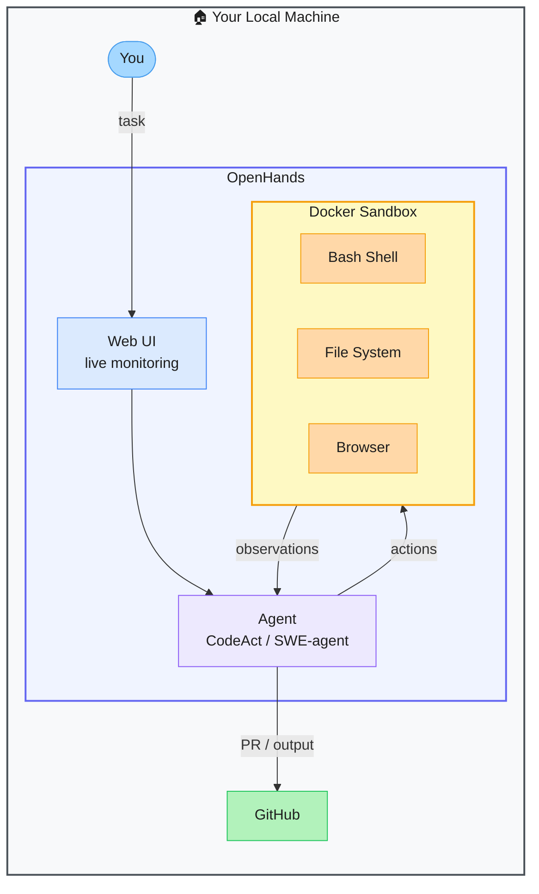

# OpenHands — Open-Source AI Software Development Agent

> **Repo:** [OpenHands/OpenHands](https://github.com/OpenHands/OpenHands)
> **Stars:**  | **License:** MIT | **Built by:** All Hands AI
> **Runs:** Locally via Docker — full sandboxed Linux environment

---

## What is it?

OpenHands is an open-source AI agent that operates like a junior developer — given a task, it writes code, runs commands, browses the web, and deploys results inside a sandboxed Linux environment. It is one of the most active AI dev agent projects, with 70k+ stars.

---

## The Problem It Solves

| Without OpenHands | With OpenHands |
|------------------|----------------|
| AI assistants suggest code but can't run or verify it | Agent runs code in a real Linux sandbox, sees the output, fixes errors |
| Local execution is risky — agent could damage your system | Docker sandbox isolates all execution safely |
| Single LLM is locked to one provider | Pluggable backends: GPT-4, Claude, Gemini, open-source models |

---

## How It Works

The agent operates in a Docker container with bash, filesystem, and browser access. It plans and executes actions through an action/observation loop. The web UI lets you monitor and steer in real time or let it run fully autonomously.

---

## Core Features

| Feature | What It Does |
|---------|--------------|
| Full Docker sandbox | Safe Linux environment — shell, filesystem, browser |
| Multiple agent strategies | CodeAct, SWE-agent, and other pluggable strategies |
| Web UI | Real-time monitoring with human-in-the-loop steering |
| GitHub integration | Opens PRs autonomously from completed tasks |
| Multi-model | GPT-4, Claude, Gemini, open-source model backends |
| 70k+ stars | One of the most active AI dev agent projects |

---

## Real-World Use Cases

| Task | What OpenHands Does |
|------|-------------------|
| Fix a bug | Reads the code, identifies root cause, patches it, verifies tests |
| Implement a feature | Plans the implementation, writes code across multiple files, tests |
| Write documentation | Reads codebase, generates accurate docs, commits them |
| Set up a project | Scaffolds entire project structure from a spec |

---

## When to Use It

**Good fit:**
- End-to-end coding tasks that require running code to verify results
- Teams wanting an open-source alternative to Devin
- Any task where you want a visual window into what the agent is doing

**Not the right tool:**
- Simple code suggestions without execution (use a standard LLM)
- Environments where Docker is not available or permitted
