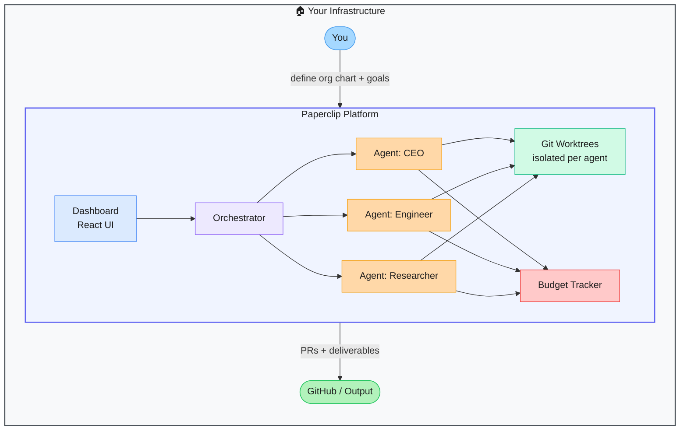

# Paperclip — Autonomous AI-Agent Business Orchestration Platform

> **Repo:** [paperclipai/paperclip](https://github.com/paperclipai/paperclip)
> **Stars:**  | **License:** MIT | **Built by:** Agency Enterprise (paperclipai)
> **Runs:** Locally via Node.js server + React UI, or self-hosted

---

## What is it?

Paperclip is an open-source platform for orchestrating fleets of AI agents toward business goals. You define an org chart of agents — each with a role, budget, and goals — and a unified dashboard supervises their work, spend, and output across tasks.

---

## The Problem It Solves

| Without Paperclip | With Paperclip |
|-------------------|----------------|
| Managing multiple agents is chaotic — no unified view | One dashboard for all agents, goals, and spend |
| No cost controls on agent API usage | Per-agent budget enforcement |
| Coordinating handoffs between agents is manual | Org chart structure handles task routing automatically |
| Hard to know what any agent is doing | Real-time activity and spend monitoring |

---

## How It Works

You build an org chart — CEO agent, engineering agents, research agents. Goals flow down the hierarchy. Each agent works in its own git worktree, and all work surfaces in the dashboard alongside cost tracking.

---

## Core Features

| Feature | What It Does |
|---------|--------------|
| Agent org charts | Assign roles, responsibilities, and reporting structure to agents |
| Goal assignment | Top-level goals cascade down to sub-agents automatically |
| Cost tracking | Per-agent spend dashboard with budget caps |
| Git worktree provisioning | Each agent gets an isolated branch and working directory |
| Plugin system | Extend agents with custom tools and integrations |
| MCP tool exposure | Agents can call MCP tools as part of their work |

---

## Real-World Use Cases

| Scenario | What You Set Up | What You Get |
|----------|----------------|--------------|
| Autonomous software company | CEO + engineer + QA agents | End-to-end feature development with PRs |
| Research automation | Researcher + writer + reviewer | Reports drafted, reviewed, and published |
| Content operation | Planner + writers + editor | Scheduled content pipeline with cost cap |

---

## When to Use It

**Good fit:**
- Coordinating multiple AI agents toward a shared business objective
- Teams wanting visibility and cost control across agent fleets
- Autonomous workflows where agents hand off work to each other

**Not the right tool:**
- Single-agent tasks (overkill)
- Real-time interactive workflows where human-in-the-loop is required at every step
