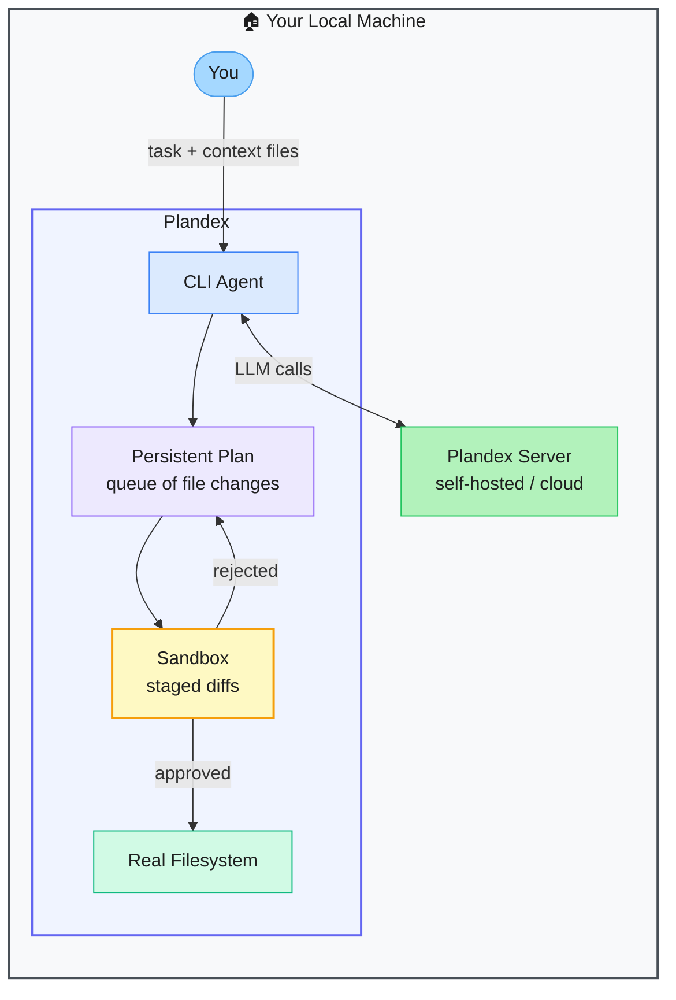

# Plandex — Terminal AI Coding Agent for Large Multi-File Tasks

> **Repo:** [plandex-ai/plandex](https://github.com/plandex-ai/plandex)
> **Stars:**  | **License:** MIT | **Built by:** plandex-ai
> **Runs:** Locally as a CLI + self-hostable server

---

## What is it?

Plandex is a terminal-based AI coding agent purpose-built for large, multi-file tasks. It maintains a persistent plan, stages all file changes in a sandbox before applying them, and lets you review, reject, or roll back individual changes — so nothing touches your real codebase until you approve it.

---

## The Problem It Solves

| Standard AI Coding Tools | Plandex |
|--------------------------|---------|
| Lose context on large projects spanning many files | Persistent plan holds context across the entire task |
| Changes applied immediately — no preview | All diffs staged in a sandbox; nothing applied until approved |
| No rollback if the agent makes a bad edit | Full rollback of the entire plan or individual changes |

---

## How It Works

You load files and context explicitly. The LLM generates diffs that queue in the sandbox. You review each change, approve the whole plan, or roll back. Nothing touches your real files until you say so.

---

## Core Features

| Feature | What It Does |
|---------|--------------|
| Persistent plan | Maintains a queue of file changes across the entire task |
| Sandbox staging | All diffs preview before touching the real filesystem |
| Explicit context | You control exactly what the agent sees (files, URLs, notes) |
| Rollback | Undo individual changes or the entire plan |
| Self-hostable server | Full control over data and model endpoints |
| Multi-model | OpenAI, Anthropic, open-source backends |

---

## Real-World Use Cases

| Task | Why Plandex |
|------|------------|
| Refactor across 20+ files | Persistent plan holds the full scope; review each change |
| Migrate a codebase to a new framework | Stage all diffs, approve file by file |
| Implement a large feature | Plan queues up the work; nothing applied until reviewed |

---

## When to Use It

**Good fit:**
- Large, multi-file tasks where context and correctness both matter
- Developers who want to review every AI change before it touches real code
- Teams needing a self-hosted coding agent with full data control

**Not the right tool:**
- Quick single-file edits (simpler tools are faster)
- Fully autonomous workflows where human review isn't needed
