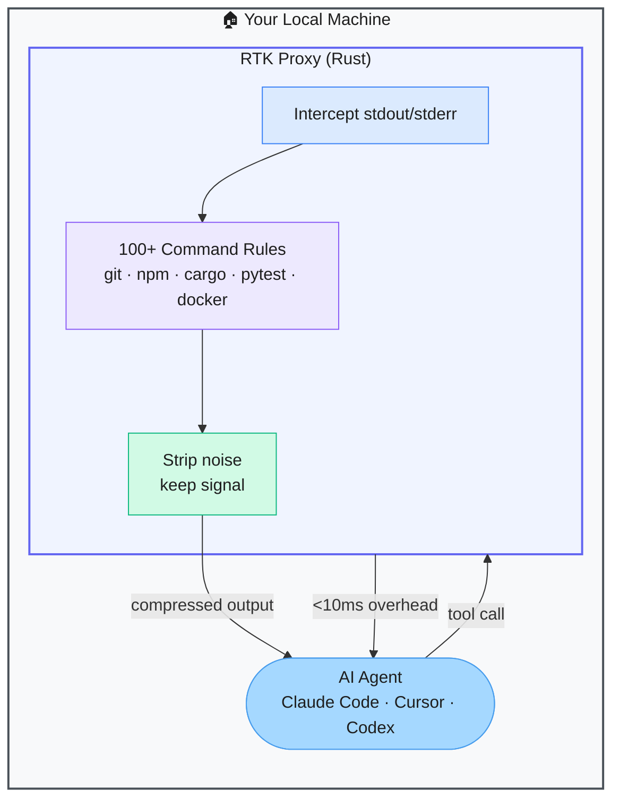

# RTK — Token Compressor for Agentic Coding Sessions

> **Repo:** [rtk-ai/rtk](https://github.com/rtk-ai/rtk)
> **Stars:**  | **License:** Apache 2.0 | **Built by:** rtk-ai
> **Runs:** Locally — single Rust binary, zero dependencies

---

## What is it?

RTK is a transparent CLI proxy that intercepts command output before it reaches your AI coding agent, strips irrelevant noise, and forwards a compressed version. It reduces token consumption by 60–90% on common dev commands — cutting cost and freeing context window for what actually matters.

---

## The Problem It Solves

| Raw Command Output to LLM | RTK |
|--------------------------|-----|
| `git diff` dumps thousands of lines including unchanged context | Compressed diff shows only the signal |
| `pytest` output floods context with passing test details | Only failures and summaries forwarded |
| Token costs accumulate fast on long agentic sessions | 60–90% reduction on 100+ common commands |

---

## How It Works

You prefix commands with `rtk` (or alias it). RTK captures the output, applies the matching compression rule for that command type, and returns the stripped version to the agent. Less than 10ms overhead. Fully transparent — you can still see full output yourself.

---

## Core Features

| Feature | What It Does |
|---------|--------------|
| 60–90% token reduction | Strips irrelevant output from common dev commands |
| 100+ command rules | Pre-configured for git, npm, cargo, pytest, docker, ruff, and more |
| <10ms overhead | Native Rust — essentially zero performance cost |
| Transparent proxy | Works with Claude Code, Cursor, Codex — no configuration |
| Single binary | Zero dependencies, install via Homebrew, Cargo, or binary download |
| Cross-platform | macOS, Linux, Windows |

---

## Real-World Use Cases

| Command | Without RTK | With RTK |
|---------|------------|---------|
| `git diff` | 3,000 tokens | ~300 tokens |
| `cargo test` | 2,000 tokens (all passing tests) | ~150 tokens (failures only) |
| `npm install` | 1,500 tokens (dependency tree) | ~100 tokens (summary) |

---

## When to Use It

**Good fit:**
- Long agentic coding sessions where token costs accumulate
- Any project using Claude Code, Cursor, or Codex for multi-step development
- Teams paying API costs who want to reduce them without changing workflow

**Not the right tool:**
- The agent needs the full verbose output to make a decision (e.g., detailed logs)
- Simple one-off scripts where token cost isn't a concern
