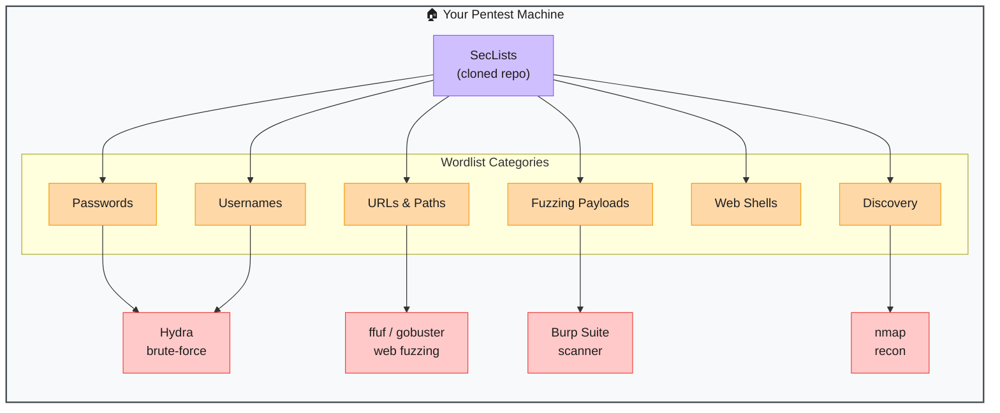

# SecLists — The Pentester's Wordlist Arsenal

> **Repo:** [danielmiessler/SecLists](https://github.com/danielmiessler/SecLists)
> **Stars:**  | **License:** MIT | **Built by:** Daniel Miessler
> **Runs:** No install — clone it and point your tools at the files

---

## What is it?

SecLists is a collection of thousands of wordlist files used during security assessments. It's not a tool — it's ammunition. You pull it into your pentest environment once, and every fuzzer, brute-forcer, and scanner you run can draw from it. One repo replaces hunting across dozens of scattered text files.

---

## The Problem It Solves

| Without SecLists | With SecLists |
|-----------------|---------------|
| Hunt for wordlists across random GitHub repos and forums | One clone gets you everything |
| Inconsistent quality — outdated passwords, missing patterns | Curated, community-maintained, battle-tested lists |
| No organisation — hard to find the right list for the job | Structured by category: passwords, usernames, URLs, fuzzing, etc. |
| Miss vulnerabilities because your wordlist is too narrow | Broad and deep coverage increases discovery rate |

---

## How It Works

**Workflow:**
1. Clone once: `git clone https://github.com/danielmiessler/SecLists`
2. Pick the right list for your task (see categories below)
3. Pass the file path to your tool of choice
4. Run — the tool cycles through every entry in the list against your target

---

## Core Categories

| Category | Path | What's Inside |
|----------|------|---------------|
| Passwords | `Passwords/` | rockyou.txt, common passwords, leaked credential dumps |
| Usernames | `Usernames/` | Common usernames, name lists, service-specific accounts |
| Web Content | `Discovery/Web-Content/` | Directory names, file paths, CMS-specific paths |
| Fuzzing | `Fuzzing/` | SQL injection, XSS, path traversal, command injection payloads |
| DNS | `Discovery/DNS/` | Subdomain wordlists for DNS brute-forcing |
| Web Shells | `Web-Shells/` | Common shell names used in upload attacks |
| Miscellaneous | `Miscellaneous/` | User agents, IANA ports, char sets |

---

## Real-World Use Cases

| Task | Tool | SecLists File |
|------|------|--------------|
| Brute-force SSH login | Hydra | `Passwords/Common-Credentials/10-million-password-list-top-1000.txt` |
| Discover hidden web directories | ffuf / gobuster | `Discovery/Web-Content/directory-list-2.3-medium.txt` |
| Find subdomains | amass / subfinder | `Discovery/DNS/subdomains-top1million-5000.txt` |
| Test for SQLi / XSS | Burp Suite Intruder | `Fuzzing/SQLi/` or `Fuzzing/XSS/` |
| Enumerate CMS users | WPScan / custom | `Usernames/top-usernames-shortlist.txt` |

---

## SecLists vs Alternatives

| Option | Size | Curated | Updated | Best For |
|--------|------|---------|---------|---------|
| **SecLists** | Massive | Yes | Actively | General-purpose pentesting — covers everything |
| rockyou.txt (standalone) | Large | No | Frozen | Password cracking only |
| FuzzDB | Medium | Yes | Less active | Fuzzing and injection payloads |
| PayloadsAllTheThings | Medium | Yes | Active | Specific payload research and reference |
| Custom wordlists (cewl) | Small | N/A | Per-target | Target-specific recon |

---

## When to Use It

**Good fit:**
- Any web app pentest — directory brute-forcing is almost always step one
- Credential stuffing / brute-force tests on auth endpoints
- DNS recon and subdomain enumeration
- Fuzzing for injection vulnerabilities

**Not the right tool:**
- You need a wordlist tailored to a specific target — use `cewl` to generate one from the target's own site
- You're doing binary exploitation or network-layer attacks — wrong domain
