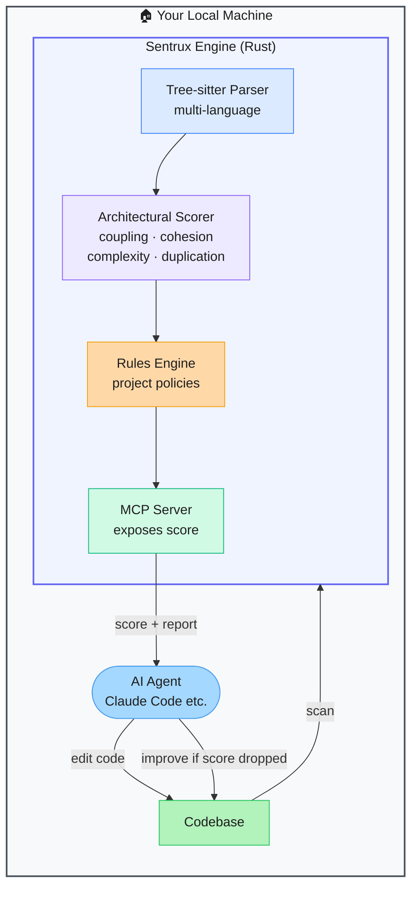

# Sentrux — Architectural Health Sensor for AI Coding Agents

> **Repo:** [sentrux/sentrux](https://github.com/sentrux/sentrux)
> **Stars:**  | **License:** MIT | **Built by:** sentrux
> **Runs:** Locally — native Rust binary; MCP server for agent integration

---

## What is it?

Sentrux is a Rust-native codebase scanner that produces a quantitative architectural health score — measuring coupling, cohesion, complexity, and duplication — and exposes the result via an MCP server. AI coding agents can query the score after each edit and loop until quality improves, turning architecture into a feedback signal.

---

## The Problem It Solves

| Agents Without Quality Feedback | Sentrux |
|---------------------------------|---------|
| Agents write code that works but is poorly structured | Quantitative health score after each edit tells the agent if quality improved |
| No signal distinguishing "working" from "well-architected" | Coupling, cohesion, complexity, and duplication all scored separately |
| Manual code reviews are the only architectural gate | Agent can run score → edit → score loops autonomously |

---

## How It Works

Sentrux scans the codebase, computes an architectural health score per file and overall, and exposes it via MCP. The agent checks the score after each edit — if it dropped, the agent revises. This creates a self-correcting quality loop.

---

## Core Features

| Feature | What It Does |
|---------|--------------|
| Rust-native scanner | Fast, multi-language analysis via Tree-sitter |
| Architectural health score | Coupling, cohesion, complexity, and duplication metrics |
| MCP server | Agents query the score directly from Claude Code or any MCP client |
| Rules engine | Define project-specific quality thresholds and policies |
| Per-file + overall scores | Pinpoint which files are degrading the architecture |
| Multi-language | Python, TypeScript, Rust, COBOL, and more via language plugins |

---

## Real-World Use Cases

| Scenario | How Sentrux Helps |
|----------|------------------|
| Agent-driven refactoring | Agent refactors, checks score, iterates until score improves |
| CI quality gate | Fail the build if architectural health score drops below threshold |
| Technical debt tracking | Track health score over time across commits |
| Legacy codebase assessment | Instant quantified view of architectural health |

---

## When to Use It

**Good fit:**
- Teams using AI agents for code generation who want quality guardrails
- Projects where architectural health is tracked as a metric
- Self-improving agent loops that need a quality signal to optimize toward

**Not the right tool:**
- Projects where code style and linting (not architecture) are the main concern
- Very small codebases where informal review is sufficient
