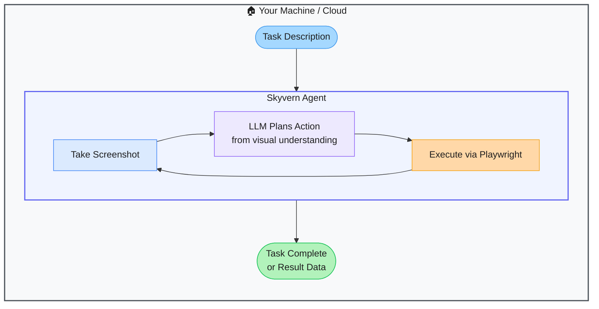

# Skyvern — Vision-Based Browser Automation That Survives UI Changes

> **Repo:** [Skyvern-AI/skyvern](https://github.com/Skyvern-AI/skyvern)
> **Stars:**  | **License:** AGPL-3.0 | **Built by:** Skyvern-AI
> **Runs:** Self-hosted via Docker or Skyvern cloud

---

## What is it?

Skyvern automates browser workflows using computer vision and LLMs instead of CSS selectors. It looks at a screenshot, understands what's on the page, and takes the right action — just like a human would. This makes automations resilient: when a website's HTML changes, Skyvern's workflows keep working.

---

## The Problem It Solves

| Selector-Based Automation | Skyvern |
|--------------------------|---------|
| CSS/XPath selectors break when the site updates | Vision-based — reads the UI the same way a human does |
| Writing selectors requires HTML inspection for every element | Describe the action in plain language; Skyvern finds the element |
| Multi-page forms need complex state management | Workflow engine handles multi-step, multi-page tasks natively |

---

## How It Works

Skyvern captures a screenshot, the LLM identifies interactive elements and plans the next action, Playwright executes it. Then another screenshot, next action — loop until complete. No selectors, no fragile element IDs.

---

## Core Features

| Feature | What It Does |
|---------|--------------|
| Vision-first automation | No CSS selectors — reads UI visually like a human |
| LLM action planning | Plans each step from a live screenshot |
| Workflow engine | Chains multi-step, multi-page tasks with conditional logic |
| CAPTCHA handling | Resolves common CAPTCHAs during automation |
| REST API + Python SDK | Trigger workflows from your code or CI/CD |
| Self-hostable + cloud | Run locally or use Skyvern's managed service |

---

## Real-World Use Cases

| Task | Why Skyvern |
|------|------------|
| Fill and submit multi-page web forms | Handles any form structure without custom selectors |
| Extract data from a portal | Vision-based parsing survives layout changes |
| Automate procurement workflows | Works across vendor portals with different UIs |
| QA testing web UIs | Tests that don't break when the design changes |

---

## When to Use It

**Good fit:**
- Automating third-party websites you don't control (portals, SaaS tools)
- Workflows that break every time the target site updates
- Anything involving CAPTCHAs or dynamic, JS-heavy pages

**Not the right tool:**
- High-throughput scraping (vision inference is slower than selector-based)
- Sites with a well-documented API (use the API directly)
