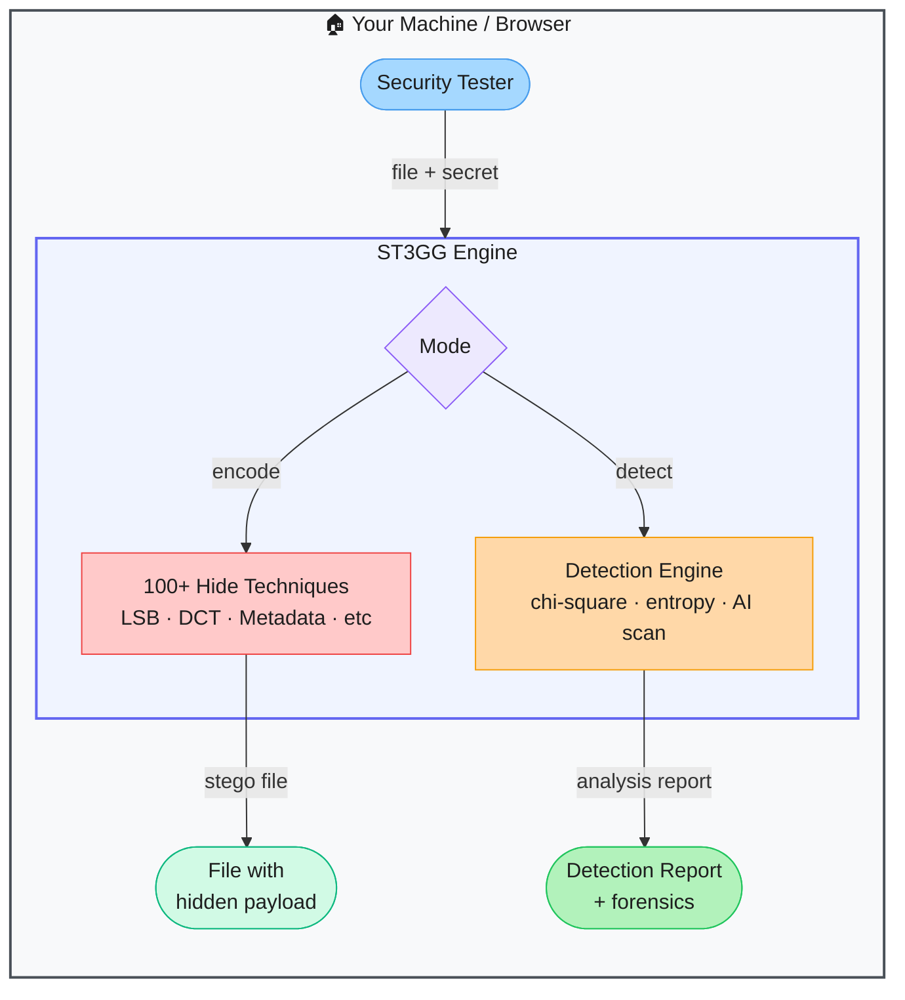

# ST3GG — All-in-One Steganography Suite

> **Repo:** [elder-plinius/ST3GG](https://github.com/elder-plinius/ST3GG)
> **Stars:**  | **License:** AGPL-3.0 | **Built by:** Pliny the Liberator (elder-plinius)
> **Runs:** In-browser (client-side JS) or locally as Python CLI / TUI / WebUI

---

## What is it?

ST3GG is a comprehensive steganography toolkit with 100+ techniques for hiding and detecting secret data across images, audio, documents, network packets, and more. It runs entirely in the browser with no server — or as a Python tool — and includes both encoding and detection/analysis modes.

---

## The Problem It Solves

| Without ST3GG | With ST3GG |
|---------------|------------|
| Testing covert data exfiltration requires hunting for separate tools per channel | One toolkit covers 100+ techniques across all media types |
| No easy way to verify if DLP systems catch steganographic exfiltration | Built-in detection mode with chi-square, entropy, and AI-powered analysis |
| Steganography research requires deep technical knowledge per method | Unified interface — pick a technique and go |
| Most tools cover images only | Images, audio, documents, network packets, text, executables |

---

## How It Works

Pick encode or detect mode. For encoding, choose a technique (LSB, DCT, metadata injection, network packet embedding, etc.) and the tool hides your payload. For detection, the analysis engine runs chi-square statistics, bit-plane entropy checks, and AI-powered scanning to surface hidden content.

---

## Core Features

| Feature | What It Does |
|---------|--------------|
| 100+ techniques | LSB, DCT, metadata, audio steganography, network packet embedding, document injection |
| Dual mode | Both hide (encode) and find (detect) in one tool |
| In-browser | Pure client-side JS — nothing is sent to a server |
| Matryoshka mode | Nested steganography — hide data inside already-hidden data |
| AI-powered detection | Machine learning scan on top of statistical analysis |
| 20+ file formats | PNG, JPEG, WAV, MP3, PDF, DOCX, PCAP, and more |

---

## Real-World Use Cases

| Task | How |
|------|-----|
| Test if DLP catches covert exfiltration | Encode a payload using various techniques, run against your DLP |
| Forensic analysis of suspicious files | Detection mode on any file to surface hidden content |
| CTF steganography challenges | Broad technique coverage speeds up flag hunting |
| Security awareness training | Demonstrate how data can be hidden in plain sight |

---

## When to Use It

**Good fit:**
- Penetration testers validating DLP and SIEM detection coverage
- CTF players facing steganography challenges
- Security researchers studying covert data channels
- Forensic analysis of files suspected of carrying hidden payloads

**Not the right tool:**
- Production data-hiding use cases (AGPL licence; review requirements)
- Network-scale automated scanning (single-file tool, not a fleet scanner)
