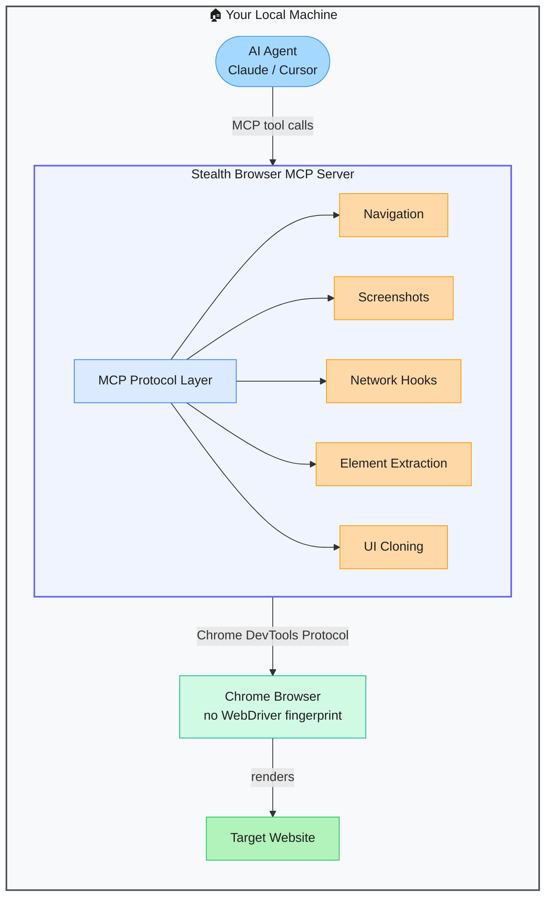

# Stealth Browser MCP — Undetectable Browser Automation for AI Agents

> **Repo:** [vibheksoni/stealth-browser-mcp](https://github.com/vibheksoni/stealth-browser-mcp)
> **Stars:**  | **License:** MIT | **Built by:** vibheksoni
> **Runs:** Locally — Chrome instance controlled via CDP, exposed as an MCP server

---

## What is it?

Stealth Browser MCP is a browser automation server that exposes 90 tools over the Model Context Protocol, letting AI agents control a real Chrome browser without triggering anti-bot defences. It uses nodriver (no WebDriver fingerprint) so sites like Cloudflare see it as a genuine user, not a bot.

---

## The Problem It Solves

| Without Stealth Browser MCP | With Stealth Browser MCP |
|-----------------------------|--------------------------|
| Playwright / Selenium get blocked by Cloudflare, DataDome, and similar | Bypasses anti-bot systems by using raw Chrome DevTools Protocol |
| Browser automation requires custom glue code per AI agent | Drop-in MCP server — any MCP client (Claude Desktop, Cursor) connects instantly |
| 90 separate browser actions need individual tool implementations | 90 tools across 11 categories, pre-built and ready |

---

## How It Works

Chrome runs via nodriver — a CDP wrapper that never injects the `navigator.webdriver` flag that anti-bot systems detect. The MCP server wraps every browser action as a callable tool so agents never write browser code directly.

---

## Core Features

| Feature | What It Does |
|---------|--------------|
| Anti-bot bypass | nodriver + CDP = no WebDriver fingerprint, passes Cloudflare |
| 90 tools | Navigation, clicks, forms, screenshots, network hooks, DOM extraction, UI cloning |
| Lean mode | Optional 22-tool subset for token-efficient agent sessions |
| Network interception | Inspect and modify HTTP requests/responses mid-flight |
| Pixel-perfect UI clone | Capture a full page's layout for visual analysis |
| MCP-native | Works directly with Claude Desktop, Cursor, or any MCP client |

---

## Real-World Use Cases

| Task | What You Do | What It Does |
|------|-------------|--------------|
| Scrape a Cloudflare-protected site | Tell your agent to fetch the data | Browser opens, loads the page, extracts content |
| Automate a web form | Describe the form fields | Fills and submits with human-like timing |
| Monitor a page for changes | Agent polls a URL | Screenshots + DOM diff on each check |
| Intercept API calls | Attach network hooks | Logs all XHR/fetch calls for reverse engineering |

---

## When to Use It

**Good fit:**
- Scraping or automating sites that block standard automation tools
- Giving AI agents real browser capabilities inside Claude Desktop or Cursor
- Tasks needing both navigation and network-layer inspection

**Not the right tool:**
- Simple API-based data collection (no browser needed)
- High-volume scraping at scale (single Chrome instance; not built for parallel fleet)
