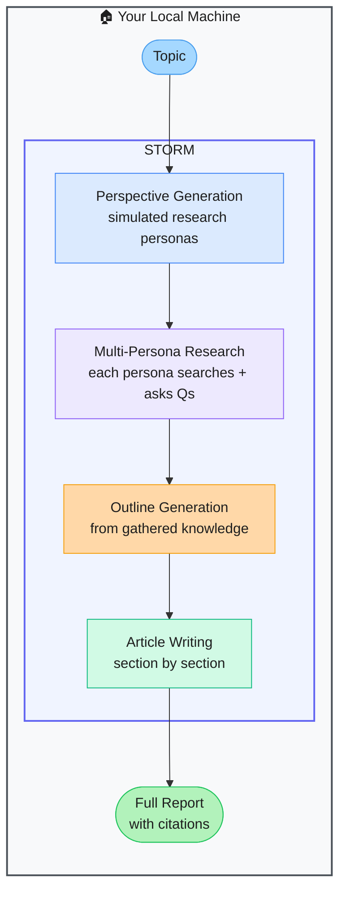

# STORM — Synthesis of Topic Outlines through Retrieval and Multi-perspective Question Asking

> **Repo:** [stanford-oval/storm](https://github.com/stanford-oval/storm)
> **Stars:**  | **License:** MIT | **Built by:** Stanford OVAL Lab
> **Runs:** Locally via Python — web search integration required

---

## What is it?

STORM is an LLM-powered knowledge curation system from Stanford. Give it a topic and it simulates multiple research personas, each conducting web searches and asking different questions, then synthesises the gathered knowledge into a full Wikipedia-style article with citations. A Co-STORM variant supports collaborative human-AI research.

---

## The Problem It Solves

| Manual Research Writing | STORM |
|------------------------|-------|
| Writing a well-cited research report takes hours | Full pipeline from topic to cited article, automated |
| One researcher can't cover all angles of a complex topic | Multiple simulated personas cover diverse perspectives |
| Sources are often cherry-picked or narrow | Multi-perspective search ensures breadth before synthesis |

---

## How It Works

STORM generates a set of research perspectives, simulates each persona doing web Q&A, collects all gathered information, structures it into an outline, and writes the article section by section. All citations are preserved inline.

---

## Core Features

| Feature | What It Does |
|---------|--------------|
| Multi-persona simulation | Diverse research angles for broader, less biased coverage |
| Automated outline | Structures gathered knowledge before writing begins |
| Full article generation | Long-form, Wikipedia-style report with inline citations |
| Co-STORM | Interactive collaborative mode — human and AI research together |
| Pluggable retrieval | Web search (Bing, You.com) or custom corpora |
| Multi-LLM | Any LLM backend supported |

---

## Real-World Use Cases

| Task | What STORM Produces |
|------|-------------------|
| New technology research | 2,000+ word overview with history, how it works, use cases, citations |
| Competitive analysis | Multi-perspective report covering strengths, weaknesses, market position |
| Literature review starter | Structured summary of a research area with sourced claims |
| Due diligence on a company | Comprehensive report from public sources |

---

## When to Use It

**Good fit:**
- Producing first-draft research reports on any topic
- Exploring a new domain and needing broad, well-sourced coverage fast
- Teams using LLMs to accelerate knowledge work

**Not the right tool:**
- Tasks requiring proprietary internal data (STORM uses web search)
- Real-time or very recent information (search results lag)
