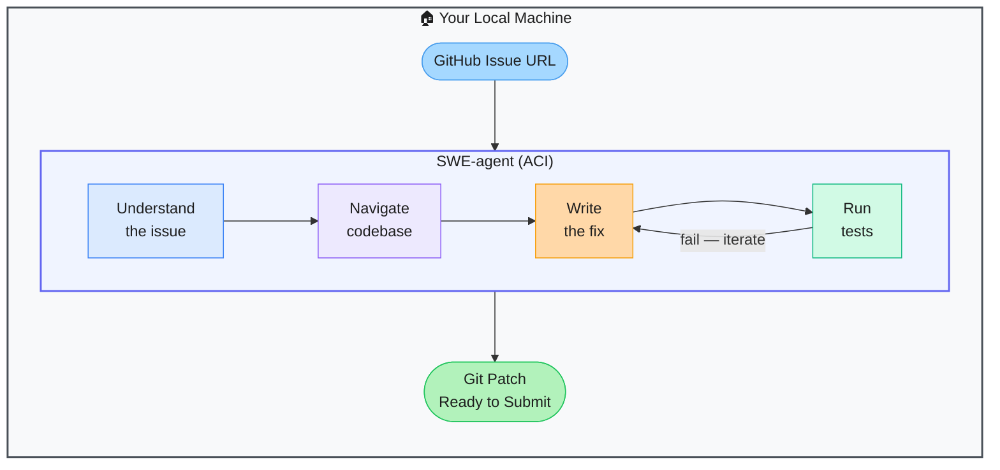

# SWE-agent — Autonomous GitHub Issue Fixer

> **Repo:** [SWE-agent/SWE-agent](https://github.com/SWE-agent/SWE-agent)
> **Stars:**  | **License:** MIT | **Built by:** Princeton NLP
> **Runs:** Locally via Python — connects to any LLM backend

---

## What is it?

SWE-agent reads a GitHub issue and automatically writes a patch to fix it. Given a repo and an issue URL, the agent uses a purpose-built Agent-Computer Interface (ACI) to navigate the codebase, write the fix, run the tests, and iterate until resolved. Introduced at NeurIPS 2024.

---

## The Problem It Solves

| Manual Bug Fixing | SWE-agent |
|------------------|-----------|
| Developer reads issue → understands codebase → writes fix → runs tests | Agent does the entire loop autonomously |
| Maintenance backlog grows faster than engineers can handle it | One agent can work through issues in parallel |
| LLMs without a proper code interface make poor edits | ACI gives the agent structured bash-like tools designed for code editing |

---

## How It Works

The ACI provides minimal, purposeful tools: view files, edit regions, search code, run bash commands. The LLM iterates — propose edit → run tests → read output → revise — until all tests pass or the budget is exhausted.

---

## Core Features

| Feature | What It Does |
|---------|--------------|
| Agent-Computer Interface | Purpose-built tools for code navigation, editing, and testing |
| GitHub issue triage | Takes a URL, understands the problem, writes and tests the fix |
| LLM-agnostic | Works with GPT-4, Claude, open-source models |
| SWE-bench integration | Measurable pass rates on the standard software engineering benchmark |
| Security / CTF mode | Can also tackle cybersecurity challenges |
| YAML scaffolding | Configure agent behaviour per task type |

---

## Real-World Use Cases

| Task | What SWE-agent Does |
|------|-------------------|
| Fix a reported bug | Reads issue → finds root cause → patches code → verifies tests pass |
| Automated PR creation | Generates the fix and outputs a ready-to-apply diff |
| Benchmark evaluation | Run against SWE-bench to measure LLM coding ability |

---

## When to Use It

**Good fit:**
- Automating fixes for well-described, isolated bugs in existing repos
- Measuring how well different LLMs perform on real software engineering tasks
- Research into autonomous software maintenance

**Not the right tool:**
- Vague issues without clear reproduction steps (agent struggles without clear signal)
- Large architectural changes spanning many subsystems
