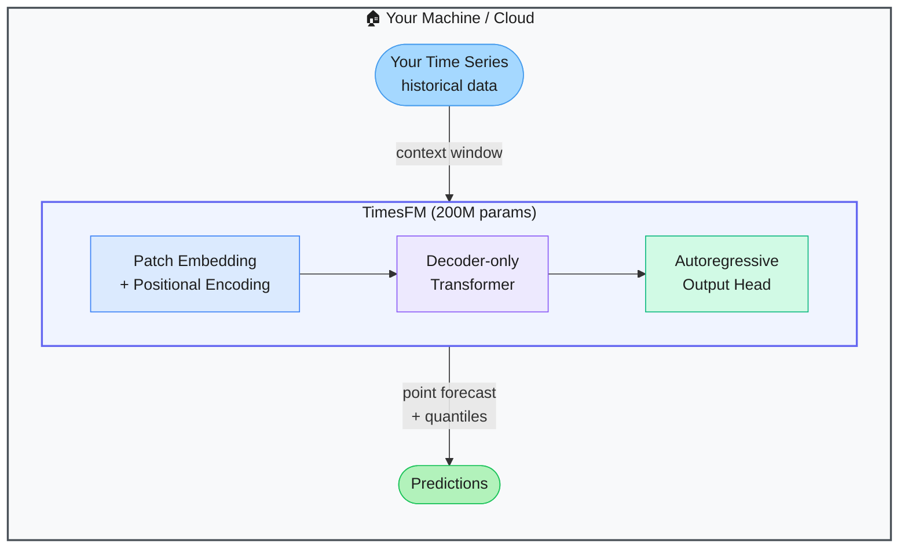

# TimesFM — Google's Zero-Shot Time Series Forecasting Model

> **Repo:** [google-research/timesfm](https://github.com/google-research/timesfm)
> **Stars:**  | **License:** Apache 2.0 | **Built by:** Google Research
> **Runs:** Locally via Python, or in the cloud via BigQuery ML / Vertex AI

---

## What is it?

TimesFM is a pretrained foundation model for time series forecasting. Trained on 100 billion real-world time points, it forecasts across retail, energy, finance, and more — without any retraining or fine-tuning on your data. Point it at a new dataset and it works out of the box.

---

## The Problem It Solves

| Traditional Forecasting | With TimesFM |
|------------------------|--------------|
| Each dataset requires training a model from scratch | Zero-shot — load it and forecast immediately |
| Training takes hours to days | Inference in seconds |
| Model degrades on unseen patterns | Pretrained on 100B diverse real-world time points |
| Separate models per domain (retail, finance, energy) | One model generalises across all domains |

---

## How It Works

TimesFM uses a decoder-only transformer architecture (similar to GPT) but for numerical sequences. It reads a context window of historical values and autoregressively predicts future values. Version 2.5 supports up to a 16k context window and outputs continuous quantile forecasts.

---

## Core Features

| Feature | What It Does |
|---------|--------------|
| Zero-shot forecasting | Works on new datasets without retraining |
| 200M parameters | Compact enough to run locally, powerful enough to beat specialised models |
| Quantile output | Returns a full uncertainty range, not just a point estimate |
| LoRA fine-tuning | Optionally adapt to your domain with a small dataset |
| 16k context window | Handle long historical sequences (v2.5) |
| BigQuery ML integration | Run directly on warehouse data without exporting |

---

## Real-World Use Cases

| Domain | Input | Output |
|--------|-------|--------|
| Retail | Weekly sales history per SKU | Demand forecast for next 12 weeks |
| Energy | Hourly power consumption | Load forecast for grid planning |
| Finance | Daily closing prices | Short-horizon price range forecast |
| Supply chain | Lead time and inventory data | Reorder point predictions |

---

## When to Use It

**Good fit:**
- You have time series data and need forecasts fast, without training a model
- Multiple domains or datasets — one model covers them all
- You want uncertainty estimates (quantile output) alongside point forecasts

**Not the right tool:**
- Very long-horizon forecasts with extreme seasonality requiring domain-specific tuning
- Real-time streaming forecasts at sub-second latency (model inference adds overhead)
